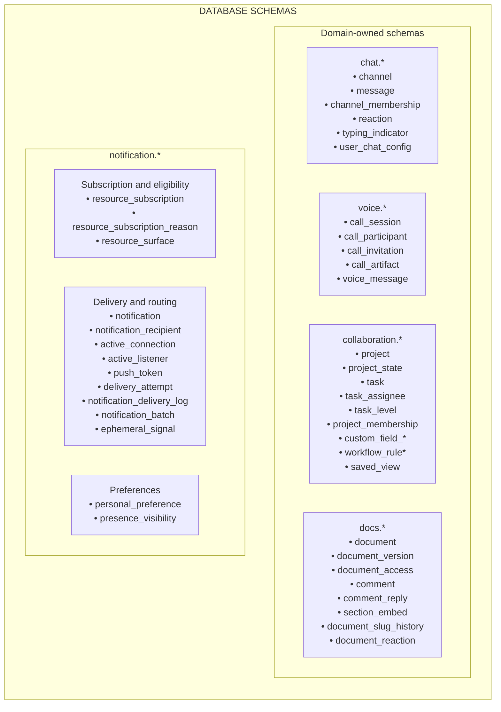
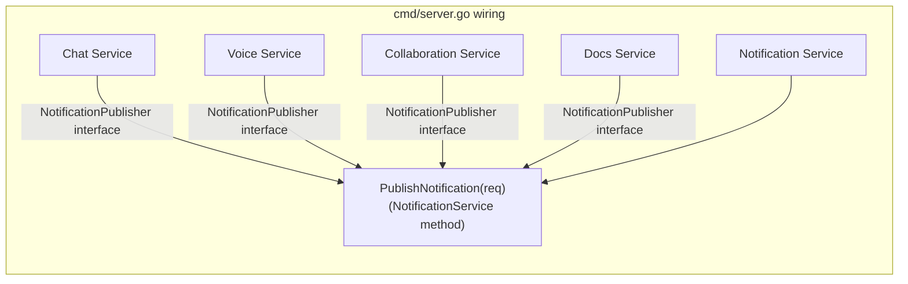
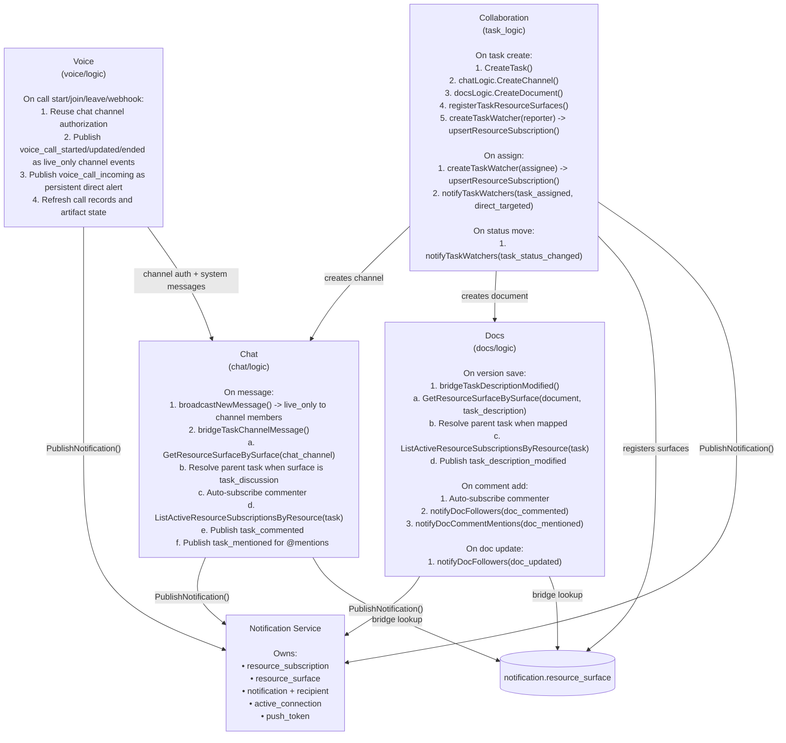
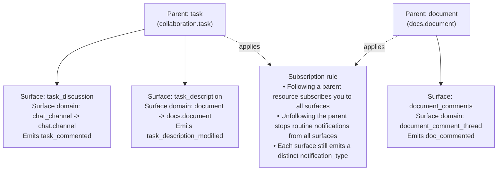
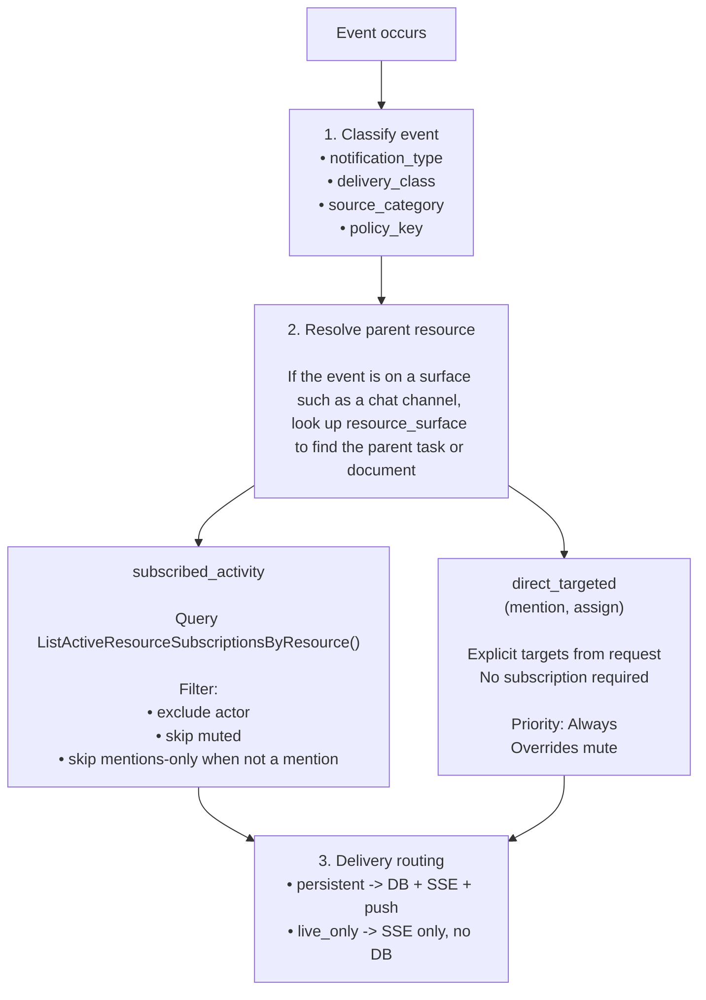

# Notification System Architecture

This document describes the final implemented architecture of the notification system after the V2 migration. It covers service ownership, data flow, cross-domain integration, and delivery mechanisms.

---

## Schema Ownership

Each domain service owns its business tables. The notification schema owns all subscription, delivery, and routing state.



### Key notification tables

| Table | Purpose |
|---|---|
| `resource_subscription` | One row per employee per parent resource. Holds `subscription_state` (active/unfollowed) and `preference_level` (all/mentions/muted). |
| `resource_subscription_reason` | Why a subscription exists: creator, reporter, assignee, manual_follow, commented, mentioned_auto, system. Multiple reasons per subscription. |
| `resource_surface` | Maps a parent resource to attached surfaces that inherit subscription. E.g. task → task_discussion (chat channel), task → task_description (document). |
| `notification` | Persisted notification record with source_domain, notification_type, policy_key, delivery_class, source_category, navigation_target. |
| `notification_recipient` | Per-employee delivery tracking: read_status, delivery_status, fallback_status, fallback_reason, acknowledgement_status (authoritative unread signal), acknowledgement_action, recipient_type, target_department_ids. |
| `active_connection` | UNLOGGED table. Registry of live SSE connections per instance, with presence_status, active_channel_id, and `last_pong_at`. Liveness is derived from `last_pong_at`; there is no stored status column. See [Presence: the ping-pong protocol](#presence-the-ping-pong-protocol). |
| `active_listener` | Reference table. Registry of backend LISTEN topic ownership per instance, including heartbeat for listener health debugging. |
| `active_context` | UNLOGGED table. Tracks active realtime context (channel, document, task) per SSE connection. Generalizes active_channel_id for multi-domain context awareness. |

## Presence: the ping-pong protocol

Presence is established by challenge and response, not by self-report.

- **Ping.** The SSE loop emits a `ping` event on each open stream every
  `PingIntervalSeconds` (20). The event's `event_id` (UUIDv7) *is* the ping id.
- **Pong.** The client answers with the unary `PresencePong` RPC, echoing the ping id
  and carrying its status, active channel, and last interaction time. A pong is also
  sent unsolicited when the client's state or context changes materially, and with
  `departing: true` on deliberate teardown.
- **Liveness.** `active_connection.last_pong_at` is advanced *only* by a received pong,
  and only from the database's own clock. Nothing server-side refreshes it.

That last rule is the point of the design. The previous scheme had the SSE loop refresh
the connection's own liveness timestamp on a ticker, so a laptop that had gone to sleep
still looked online for minutes — and `ShouldSendPush` therefore suppressed the push that
would have reached the person. A pong proves the whole round trip (server → stream →
client → RPC → server), which is exactly what a half-open stream cannot fake.

### Derived liveness state machine

There is no stored state. Given `age = now() - last_pong_at`:

| State | Condition | Meaning |
|---|---|---|
| Responsive | `age <= 45s` (`ResponsiveWindowSeconds`) | Present, and a valid live-delivery target |
| Unresponsive | `45s < age <= 90s` | Not present, not a delivery target, row still intact so a late pong restores it without a reconnect |
| Removed | `age > 90s` (`RemovalWindowSeconds`) | Row deleted by the janitor; a later pong returns `PONG_DIRECTIVE_RECONNECT` and never resurrects it |

**Invariant:** a connection is a valid live-delivery target **iff**
`last_pong_at >= now() - 45s`. Presence reads and routing use that one predicate, so they
cannot disagree.

Removal is a single `DeleteExpiredConnections` sweep per organization every 60 seconds
(`registry.go`). The old mark-then-sweep pair is gone along with the `connection_status`
column it maintained.

### The pong batcher

Each instance runs a `pongBatcher` (`pong_batcher.go`). A `PresencePong` handler
validates its request, enqueues it, and blocks on its own result channel. Every 200 ms —
or at 500 queued pongs, whichever comes first — the batcher groups the queue **by
`organization_id`** and issues one multi-row `UPDATE ... RETURNING connection_id` per
group. Each waiter is then resolved from that `RETURNING` set: present → `ACK`, absent →
`RECONNECT`.

Three properties follow from that shape:

- **Shard locality.** Grouping by organization keeps every statement single-shard, as
  Citus requires. A cross-organization batch is never issued.
- **Authoritative directives.** Because each handler awaits its own flush rather than
  firing and forgetting, it can say authoritatively that a connection no longer exists.
- **No resurrection.** The statement is an `UPDATE`, never an upsert, so a pong arriving
  after the janitor removed a row cannot recreate it.

Nothing in the batcher outlives the request that put it there, so it is not process-local
state and the database remains the single source of truth.

At the 10k-connection design target this turns roughly 500 presence writes/second into
roughly 15 statements/second carrying ~33 rows each.

### Observability

One flush tick logs batch size, flush duration, matched count, and reconnect-directive
count; the janitor logs removals per organization. Those four numbers are what a presence
incident is diagnosed from. A flush that exceeds its own window logs a warning.

### Retired tables

The following tables have been removed from the schema and are no longer used for notification delivery:

- `collaboration.task_watcher` — replaced by `notification.resource_subscription` with domain=task
- `docs.document_follower` — replaced by `notification.resource_subscription` with domain=document

---

## Service Architecture



All domain services receive `NotificationPublisher` via constructor injection. The interface has one method:

```go
type NotificationPublisher interface {
    PublishNotification(ctx context.Context, tx database.DBTX, req *rpcv1.PublishNotificationRequest) (*rpcv1.PublishNotificationResponse, error)
}
```

### Initialization order in server.go

1. Database pools (AdminPool, TenantPool)
2. Notification logic layers (NotificationLogic, VisibilityLogic, PresenceLogic, PushLogic)
3. NotificationService (owns SSE, LISTEN, publisher, registry)
4. RoutingLogic (presence-aware delivery decisions)
5. NotificationServiceConnect (RPC layer)
6. ChatLogic ← receives NotificationService as publisher
7. VoiceLogic ← receives NotificationService as publisher + ChatLogic + FileLogic + LiveKitClient
8. DocsLogic ← receives NotificationService as publisher
9. CollaborationLogic ← receives NotificationService as publisher + ChatLogic + DocsLogic

---

## Cross-Domain Call Graph

This diagram shows which service calls which, and through what mechanism.



---

## Resource Surface Model

Tasks and documents are parent resources that own attached communication surfaces. This is the core abstraction that enables cross-domain notification bundling.



---

## V2 Subscription Resolution

When an event occurs on a resource (or its surface), recipient resolution follows this pipeline:



---

## Event Taxonomy

### Notification types by domain

| Domain | Event Type | Event Class | Source Category | Delivery Class | Policy Key |
|---|---|---|---|---|---|
| **Chat** | `message` | subscribed_activity | activity | live_only | `chat_message` |
| **Chat** | `mention` | direct_targeted | mention | persistent | `chat_mention` |
| **Chat** | `reply` | subscribed_activity | activity | persistent | `chat_reply` |
| **Chat** | `typing` | live_ephemeral | — | live_only | `chat_typing_live` |
| **Chat** | `reaction` | live_ephemeral | — | live_only | `chat_reaction_live` |
| **Voice** | `voice_call_incoming` | direct_targeted | system | persistent | `chat_voice_call_incoming` |
| **Voice** | `voice_call_started` | live_ephemeral | system | live_only | `chat_voice_call_live` |
| **Voice** | `voice_call_updated` | live_ephemeral | system | live_only | `chat_voice_call_live` |
| **Voice** | `voice_call_ended` | live_ephemeral | system | live_only | `chat_voice_call_live` |
| **Tasks** | `task_assigned` | direct_targeted | system | persistent | `task_assignment` |
| **Tasks** | `task_status_changed` | subscribed_activity | activity | persistent | `task_status` |
| **Tasks** | `task_commented` | subscribed_activity | activity | persistent | `task_comment` |
| **Tasks** | `task_mentioned` | direct_targeted | mention | persistent | `task_mention` |
| **Tasks** | `task_description_modified` | subscribed_activity | activity | persistent | `task_description_modified` |
| **Tasks** | `task_updated` | subscribed_activity | activity | persistent | `task_update` |
| **Docs** | `doc_updated` | subscribed_activity | activity | persistent | `document_update` |
| **Docs** | `doc_commented` | subscribed_activity | activity | persistent | `document_comment` |
| **Docs** | `doc_mentioned` | direct_targeted | mention | persistent | `document_mention` |

> **Note on Event Class**: The "Event Class" column (`subscribed_activity`, `direct_targeted`, `live_ephemeral`) is a logical classification used in this document for clarity. It is not represented as a code constant. In implementation, the combination of `delivery_class` + `source_category` + `priority` determines routing behavior.

> **Note**: An additional `persistent_default` policy key exists in code as a fallback default for persistent notifications that don't match a specific policy key.

### Priority levels

| Value | Name | Behavior |
|---|---|---|
| 0 | Always | Deliver regardless of presence (critical, assignments, mentions) |
| 1 | Default | Deliver when not offline |
| 2 | Online | Deliver only when online |
| 4 | Silent | No delivery, log only |

### Chat payload metadata

For chat `message`, `mention`, and `reply` notifications, the backend now includes richer `actionData` metadata so clients do not need to infer chat context from the title string alone.

Current fields:

- `channelId`
- `channelType`
- `channelName`
- `messageId`
- `senderEmployeeId`
- `senderName`
- `action`
- `parentMessageId` for replies and thread-targeted notifications

The detailed contract and current mobile foreground behavior live in [NOTIFICATION-RULES.md](./NOTIFICATION-RULES.md).

### Voice payload metadata

Voice live events are channel-scoped SSE events. Clients use the `actionData` payload to update active-call banners, incoming-call surfaces, and completed call records without polling.

Current fields:

- `action`: `started`, `joined`, `left`, `ended`, `invited`, `invite_accepted`, `invite_declined`, `participant_joined`, `participant_left`, `recording_processing`, or `recording_updated`
- `channelId`
- `callId`
- `state`
- `participantCount`
- Optional `employeeId`, `employeeIds`, `invitationId`, `initiatorEmployeeId`, `alreadyInAnotherCall`, and `outcome`

Incoming-call notifications are persistent and targeted to explicit invitees with priority `Always`. Started/updated/ended events are `live_only` with priority `Silent` and set `active_channel_id`, so they are delivered through the ephemeral channel path and are not stored in the notification center.

---

## Delivery Pipeline

```mermaid
flowchart TD
    subgraph Publishing[Publishing flow]
        Publish[PublishNotification(req)]
        LiveNoChannel{"delivery_class == live_only<br/>and no active_channel_id?"}
        LiveNoChannelAction["Ephemeral broadcast via NOTIFY<br/>notifyInstancesWithEphemeralData()<br/>No DB write"]
        ChannelEphemeral{"active_channel_id set and<br/>(live_only or priority == silent)?"}
        ChannelEphemeralAction["Channel-scoped ephemeral publish<br/>publishToInstancesByChannel()<br/>Used for typing and reactions"]
        ResolveRecipients["1. resolveRecipients()<br/>Expand employee_ids + department_ids"]
        CreateRows["2. createNotificationWithRecipients()<br/>Insert notification + notification_recipient rows"]
        PublishInstances["3. publishToInstances()<br/>Query active_connection<br/>Group by instance_id<br/>NOTIFY per instance<br/>Return offline employee IDs"]
        PushFallback["4. Push fallback after tx commit<br/>Check ShouldSuppressPush()<br/>Send FCM when eligible"]

        Publish --> LiveNoChannel
        LiveNoChannel -- Yes --> LiveNoChannelAction
        LiveNoChannel -- No --> ChannelEphemeral
        ChannelEphemeral -- Yes --> ChannelEphemeralAction
        ChannelEphemeral -- No --> ResolveRecipients
        ResolveRecipients --> CreateRows --> PublishInstances --> PushFallback
    end

    subgraph Receiving[Receiving flow]
        Listen["PostgreSQL LISTEN<br/>per-instance goroutine"]
        Receive["Receive NOTIFY on instance_{instanceID}_notifications"]
        Deserialize["Deserialize payload into NotificationEvent"]
        Route["Route to matching SSEConnection.EventChan<br/>by employee_id"]
        Stream["StreamNotifications() reads EventChan<br/>and sends SSE or ConnectRPC stream"]
        Client["Browser or mobile client<br/>EventSource GET /api/notifications/stream?token=JWT<br/>or ConnectRPC StreamNotifications()"]

        Listen --> Receive --> Deserialize --> Route --> Stream --> Client
    end
```

---

## Subscription Lifecycle

### How subscriptions are created

| Trigger | Resource Domain | Reason | Created By |
|---|---|---|---|
| Task created | task | `reporter` | collaboration/task_logic.go |
| Task assigned | task | `assignee` | collaboration/assignment_logic.go |
| User clicks Watch Task | task | `manual_follow` | collaboration/assignment_logic.go |
| User comments on task | task | `commented` | chat/logic.go (bridgeTaskChannelMessage) |
| Document created | document | `creator` | docs/logic.go |
| User clicks Follow Document | document | `manual_follow` | docs/follower_logic.go |
| User comments on document | document | `commented` | docs/comment_logic.go |

### How subscriptions are removed

- **Unwatch task**: Sets `subscription_state = unfollowed` and removes `manual_follow` reason
- **Unfollow document**: Sets `subscription_state = unfollowed` and removes `manual_follow` reason

### Preference levels

| Level | Receives subscribed_activity | Receives direct_targeted |
|---|---|---|
| `all` | Yes | Yes |
| `mentions` | No | Yes |
| `muted` | No | Yes for explicit direct targets such as chat mentions and reply targets |

---

## Auto-Subscription on Comment

When a user comments on a task (via the task discussion channel) or on a document:

1. The commenter is auto-subscribed to the **parent resource** (not the surface)
2. A `commented` reason is added to the subscription
3. If the subscription already exists, the reason is added without changing existing state
4. This ensures commenters receive future activity on the resource

```mermaid
flowchart TD
    Post[User posts in task discussion channel] --> Bridge[bridgeTaskChannelMessage()]
    Bridge --> Surface["GetResourceSurfaceBySurface(chat_channel, channelID)<br/>Returns parent_domain=task and parent_resource_id=taskID"]
    Surface --> Ensure["ensureTaskCommentSubscription(orgID, authorID, taskID)<br/>UpsertResourceSubscription(task, active)<br/>AddResourceSubscriptionReason(commented)"]
    Ensure --> Subscribers["ListActiveResourceSubscriptionsByResource(task, taskID)<br/>Resolve subscribers and publish task_commented"]
```

---

## End-to-End Example: Task Comment

1. Alice posts a message in task T-42's discussion channel
2. `chat.SendMessage()` creates the message
3. `broadcastNewMessage()` sends a `live_only` notification to all channel members (SSE only, no inbox)
4. `bridgeTaskChannelMessage()`:
   - Looks up `resource_surface` → channel is `task_discussion` for task T-42
   - Auto-subscribes Alice to task T-42 with reason `commented`
   - Loads all `active` subscriptions for task T-42
   - Filters out Alice (actor), muted users, mentions-only users
   - Publishes `task_commented` (persistent, activity) to remaining subscribers
   - If message has @mentions, publishes `task_mentioned` (persistent, mention, priority=always) to mentioned users
5. `NotificationService.PublishNotification()`:
   - Creates `notification` + `notification_recipient` rows
   - Looks up `active_connection` to find online instances
   - Sends PostgreSQL NOTIFY per instance
   - Identifies offline recipients → sends FCM push

---

## End-to-End Example: Task Description Edit

1. Bob edits the description document of task T-42
2. `docs.CreateVersion()` saves the new document version
3. `bridgeTaskDescriptionModified()`:
   - Looks up `resource_surface` → document is `task_description` for task T-42
   - Loads all `active` subscriptions for task T-42 (not the document)
   - Filters out Bob (actor), muted/mentions-only users
   - Publishes `task_description_modified` to remaining subscribers
4. Delivery follows the same persistent path as above

---

## Package Dependency Graph

```mermaid
flowchart TD
    Server[cmd/server.go]
    NotificationService[notification.NewNotificationService()]
    NotificationLogic[notification.NewNotificationLogic()]
    PresenceLogic[notification.NewPresenceLogic()]
    VisibilityLogic[notification.NewVisibilityLogic()]
    PushLogic[notification.NewPushLogic()]
    RoutingLogic[notification.NewRoutingLogic()]
    ChatLogic["chat.NewChatLogic(queries, notificationService)<br/>Calls notificationService.PublishNotification()<br/>Reads notification.resource_surface for task bridge"]
    VoiceLogic["voice.NewLogic(queries, chatLogic, liveKitClient, voiceConfig)<br/>Calls notificationService.PublishNotification()<br/>Uses chatLogic for channel auth and system messages<br/>Uses fileLogic for voice uploads/artifacts"]
    DocsLogic["docs.NewDocumentLogic(queries, notificationService)<br/>Calls notificationService.PublishNotification()<br/>Reads notification.resource_surface for task-description bridge"]
    CollaborationLogic["collaboration.NewLogic(queries, chatLogic, docsLogic, notificationService)<br/>Calls chatLogic.CreateChannel() on task creation<br/>Calls docsLogic.CreateDocument() on task creation<br/>Writes notification.resource_surface on task creation<br/>Writes notification.resource_subscription on watch, assign, create<br/>Calls notificationService.PublishNotification()"]

    Server --> NotificationService
    NotificationService --> NotificationLogic
    NotificationService --> PresenceLogic
    NotificationService --> VisibilityLogic
    NotificationService --> PushLogic
    NotificationService --> RoutingLogic
    Server --> ChatLogic
    Server --> VoiceLogic
    Server --> DocsLogic
    Server --> CollaborationLogic
    ChatLogic --> NotificationService
    VoiceLogic --> ChatLogic
    VoiceLogic --> NotificationService
    DocsLogic --> NotificationService
    CollaborationLogic --> ChatLogic
    CollaborationLogic --> DocsLogic
    CollaborationLogic --> NotificationService
```

### Dependency direction rules

- Chat, Voice, Docs, Collaboration, and Calendar all depend on Notification (publisher interface)
- Voice depends on Chat for room authorization and timeline announcements, and on Files for voice message/artifact storage
- Collaboration depends on Chat and Docs (creates channels and documents for tasks)
- Calendar depends on Collaboration and Docs (overlay readers for cross-domain items)
- Chat and Docs read `notification.resource_surface` to bridge events back to parent resources
- No circular dependencies: notification never calls chat/voice/docs/collaboration/calendar logic

---

## Calendar Notification Types (Feature 026)

The calendar domain introduces 6 notification types for event lifecycle, reminders, and compliance:

| Notification Type | Policy Key | Priority | Delivery | Trigger |
|---|---|---|---|---|
| `calendar_event_invite` | `calendar_event_invite` | 1 (normal) | persistent | CreateEvent — sent to all non-organizer attendees |
| `calendar_event_cancel` | `calendar_event_cancel` | 2 (high) | persistent | CancelEvent — sent to all attendees |
| `calendar_event_change` | `calendar_event_change` | 1 (normal) | persistent | UpdateEvent (time/location change) — sent to non-organizer attendees |
| `calendar_event_reminder` | `calendar_event_reminder` | 2 (high) | persistent | CalendarReminderWorkflow — fires when `fire_at <= now()` |
| `calendar_check_in_missed` | `calendar_check_in_missed` | 2 (high) | persistent | Reserved for missed check-in detection |
| `calendar_event_digest` | `calendar_event_digest` | 0 (low) | persistent | Reserved for daily calendar digest |

### CalendarReminderWorkflow

The `CalendarReminderWorkflow` is a `flows.Workflow` that polls the `calendar.event_reminder` staging table every minute:

1. **Query**: `SELECT * FROM calendar.event_reminder WHERE status = 'pending' AND fire_at <= now() LIMIT 100`
2. **For each reminder**: Publish a `calendar_event_reminder` notification to the attendee via `NotificationPublisher.PublishNotification()`
3. **Mark sent**: Update `status = 'sent'` on the reminder row
4. **Crash safety**: Idempotent — re-running after crash re-processes any pending rows that weren't marked sent

Reminder rows are created in `CreateEvent` (one per attendee, `fire_at = start_time - 15 minutes`) and cancelled in `CancelEvent` (`status = 'cancelled'`).

The workflow is registered in `server.go` via `flows.Register(flowsRegistry, workflow)` **and**
scheduled with `flows.ScheduleTx` under schedule ID `calendar_reminder_poll`. Registration
alone only makes a workflow resolvable; the `ScheduleTx` bootstrap is what makes it run. That
bootstrap was originally missing, so reminders never fired until feature 034 added it.

There is no server-side calendar presence job. A `CalendarPresenceWorkflow` existed but was
never scheduled and never worked — it queried events with a zero-UUID organization ID, so it
always read an empty set, and its "set in_meeting" branch only logged. Since the presence
ping-pong protocol, `notification.active_connection.presence_status` is written **only** by
client pongs, so any server-side write would be overwritten on the next pong. The workflow was
deleted in feature 034 rather than scheduled.

---

## File Index

| Component | File | Key Functions |
|---|---|---|
| Server wiring | `cmd/server.go` | Initialization order, dependency injection |
| Publisher | `internal/notification/publisher.go` | `PublishNotification()`, `resolveRecipients()`, `publishToInstances()` |
| Constants | `internal/notification/constants.go` | All notification types, domains, policies, delivery classes |
| SSE stream | `internal/notification/sse.go` | `setupConnection()`, event loop |
| HTTP SSE | `internal/notification/sse_http.go` | `GET /api/notifications/stream` handler |
| PG listener | `internal/notification/listener.go` | `initListener()`, LISTEN channel setup |
| Routing | `internal/notification/routing_logic.go` | `ShouldSuppressPush()`, presence-aware decisions |
| RPC layer | `internal/notification/connect.go` | `ListNotifications`, `MarkAsRead`, `StreamNotifications` |
| Presence | `internal/notification/presence_logic.go` | `RecordPongs()`, `RemoveDepartedConnections()`, `DeleteExpiredConnections()`, `GetEmployeePresence()`, `GetBatchEmployeePresence()` |
| Pong batcher | `internal/notification/pong_batcher.go` | `Submit()`, per-organization flush |
| Push | `internal/notification/push_logic.go` | FCM push fallback |
| Chat bridge | `internal/chat/logic.go` | `broadcastNewMessage()`, `bridgeTaskChannelMessage()` |
| Task surfaces | `internal/collaboration/task_logic.go` | `registerTaskResourceSurfaces()`, `createTaskWatcher()`, `notifyTaskWatchers()` |
| Task assign | `internal/collaboration/assignment_logic.go` | `AssignTask()`, `WatchTask()`, `ListTaskWatchers()` |
| Task movement | `internal/collaboration/task_logic.go` | `MoveTask()` → `notifyTaskWatchers(task_status_changed)` |
| Doc followers | `internal/docs/follower_logic.go` | `notifyDocFollowers()`, `FollowDocument()`, `UnfollowDocument()` |
| Doc comments | `internal/docs/comment_logic.go` | `AddComment()`, `notifyDocCommentMentions()` |
| Doc versions | `internal/docs/version_logic.go` | `CreateVersion()`, `bridgeTaskDescriptionModified()` |
| Calendar events | `internal/calendar/event_logic.go` | `publishEventNotification()`, `publishChangeNotification()`, `publishCancelNotification()` |
| Calendar reminders | `internal/calendar/reminder_workflow.go` | `CalendarReminderWorkflow.Run()`, `FirePendingReminders()` |
