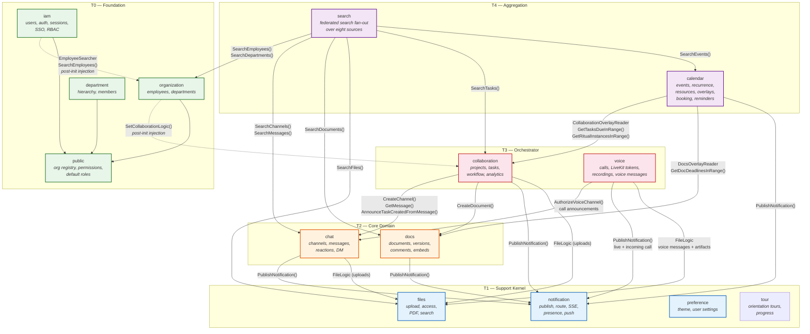
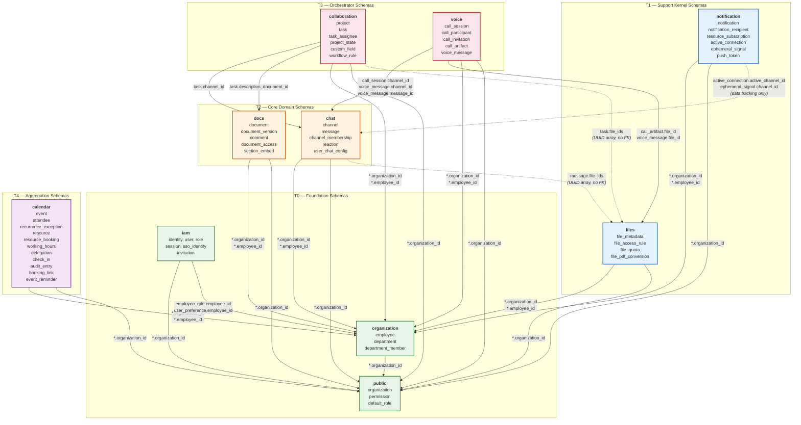
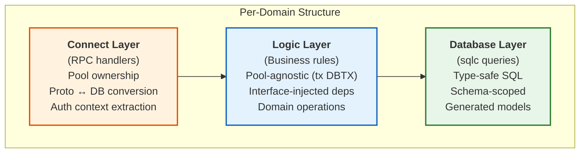
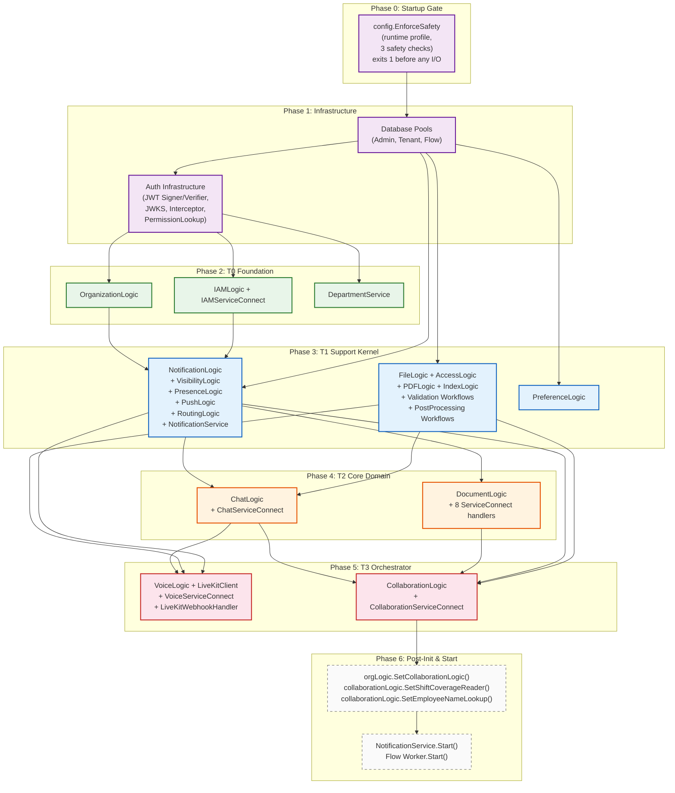

# Tech Office — System Architecture & Domain Dependency Analysis

**Version**: 1.3.1 | **Date**: 2026-09-05

This document describes the domain-driven design (DDD) architecture of the Tech Office multi-tenant SaaS platform, including dependency flow analysis across database schema references and Go code imports. The architecture enforces **inward-pointing, unidirectional dependencies** — no circular references exist between domains.

---

## Table of Contents

1. [Architecture Overview](#1-architecture-overview)
2. [Domain Layering & Dependency Rules](#2-domain-layering--dependency-rules)
3. [Domain Dependency Graph (Code-Level)](#3-domain-dependency-graph-code-level)
4. [Database Schema Dependency Graph (Data-Level)](#4-database-schema-dependency-graph-data-level)
5. [Clean Architecture Layers](#5-clean-architecture-layers)
6. [Domain Catalog](#6-domain-catalog)
7. [Cross-Domain Integration Patterns](#7-cross-domain-integration-patterns)
8. [Server Initialization Order](#8-server-initialization-order)
9. [Appendix: Full FK Reference Map](#appendix-full-fk-reference-map)

---

## 1. Architecture Overview

Tech Office is organized as a **modular monolith** following DDD principles with schema-per-domain PostgreSQL on a single node. Each business domain owns its schema, tables, and query files. Cross-domain communication happens through well-defined Go interfaces — never through direct DB joins across schemas.

```
┌───────────────────────────────────────────────────────────────────┐
│                        API / RPC Gateway                          │
│  (Connect-RPC handlers, Auth Interceptor, Permission Lookup)      │
├───────────────────────────────────────────────────────────────────┤
│                     Connect Layer (per domain)                    │
│  Pool management, proto↔DB conversion, transaction orchestration  │
├───────────────────────────────────────────────────────────────────┤
│                      Logic Layer (per domain)                     │
│  Business rules, pool-agnostic, injected via interfaces           │
├───────────────────────────────────────────────────────────────────┤
│                     Database Layer (sqlc)                          │
│  Type-safe queries, models, schema-per-domain                     │
├───────────────────────────────────────────────────────────────────┤
│         PostgreSQL (single node, organization_id tenancy)         │
│  Schemas: public | iam | organization | chat | notification |     │
│           files | docs | voice | collaboration | calendar |       │
│           compliance | flows                                      │
└───────────────────────────────────────────────────────────────────┘
```

---

## 2. Domain Layering & Dependency Rules

Domains are organized into **four tiers**. Dependencies MUST only point **downward** (from higher tiers toward lower tiers). No lateral or upward dependencies are permitted.

### Tier Model

| Tier | Role | Domains | May Depend On |
|------|------|---------|---------------|
| **T0 — Foundation** | Identity & tenant boundary | `public`, `iam`, `organization`, `department` | Nothing (except `public` for org FK) |
| **T1 — Support Kernel** | Infrastructure services consumed by business domains | `notification`, `files`, `preference`, `tour` | T0 only |
| **T2 — Core Domain** | Primary business capabilities | `chat`, `docs` | T0, T1 |
| **T3 — Orchestrator** | High-level features composing multiple core domains | `collaboration`, `voice` | T0, T1, T2 |
| **T4 — Aggregation** | Cross-domain composition with overlay readers | `calendar`, `compliance`, `search` | T0, T1, T2, T3 |

### Dependency Direction Rule

```
T4 (Calendar)       ──depends on──▶ T3 (Collaboration) via CollaborationOverlayReader
                     ──depends on──▶ T2 (Docs) via DocsOverlayReader
                     ──depends on──▶ T1 (Notification)
T3 (Collaboration) ──depends on──▶ T2 (Chat, Docs)
T3 (Voice)         ──depends on──▶ T2 (Chat) via channel authorization and call announcements
                    ──depends on──▶ T1 (Notification, Files) for SSE fanout and media artifacts
T2 (Chat, Docs)    ──depends on──▶ T1 (Notification, Files)
T1 (Notification)   ──depends on──▶ T0 (Organization, IAM)
                       ▲ INWARD ONLY — no upward or circular arrows
```

---

## 3. Domain Dependency Graph (Code-Level)

This diagram shows runtime Go code dependencies — constructor injection and method calls between `internal/` packages.



### Key Observations

1. **Notification is a Support Kernel** — it has zero imports of any other domain package. Chat, Docs, Collaboration, and Calendar all call into it via the `NotificationPublisher` interface.
2. **Files is a Support Kernel** — it has zero domain imports. Chat and Collaboration consume it for file uploads via `FileLogic` interface.
3. **Collaboration is the top-level orchestrator** — it depends on Chat (`CreateChannel` for task discussion threads), Docs (`CreateDocument` for task descriptions), Notification, and Files.
4. **Calendar is the first T4 Aggregation domain** — it depends on Collaboration and Docs via thin read-only overlay reader interfaces (`CollaborationOverlayReader`, `DocsOverlayReader`) to render cross-domain items (task due dates, ritual instances, doc deadlines) on the calendar. It also depends on Notification for invite/cancel/change/reminder publishing.
5. **Voice is a T3 Orchestrator domain** — it composes Chat authorization/announcements, Files-backed voice messages and call artifacts, Notification SSE/push fanout, and the external LiveKit media plane without adding reverse imports.
6. **Organization → Collaboration** is a controlled post-init injection (`SetCollaborationLogic()`) used solely for creating a default project during org signup. This is **not** a constructor dependency and uses interface indirection to avoid an import cycle.
7. **IAM → Organization** is the mirror of that edge, added by feature 048 for the people directory's name narrowing. `internal/iam` declares `EmployeeSearcher` and `cmd/server.go` calls `iamLogic.SetEmployeeSearcher(orgLogic)`; it is a setter, not a constructor argument, precisely because observation 6 already points `organization` at `iam`'s neighbours and a direct import would close a cycle. See §7, "The iam → organization employee searcher".

---

## 4. Database Schema Dependency Graph (Data-Level)

This diagram shows foreign key references between PostgreSQL schemas. Arrows point from the referencing table to the referenced table.



### Data-Level Dependency Notes

| Relationship | Type | Rationale |
|---|---|---|
| `notification.active_connection → chat.channel` | FK (data-tracking) | Tracks which channel the SSE connection is currently viewing for ephemeral signal routing. **Not** a code-level dependency — notification never imports chat. |
| `notification.ephemeral_signal → chat.channel` | FK (data-tracking) | Routes typing/reaction signals to active channel viewers. Same pattern — data-level only. |
| `voice.call_session / voice.voice_message → chat.channel` | FK | Voice calls and voice messages are chat-room capabilities; Chat still owns room membership and timeline rendering. |
| `voice.call_artifact / voice.voice_message → files.file_metadata` | FK | Recordings, transcripts, and uploaded voice messages are stored through the Files support kernel. |
| `chat.message.file_ids → files.file_metadata` | Soft ref (UUID array) | No FK constraint. App-level integrity. Enables file attachments in messages. |
| `collaboration.task.file_ids → files.file_metadata` | Soft ref (UUID array) | No FK constraint. App-level integrity. Enables file attachments on tasks. |

The `notification → chat` data-level FK does **not** violate the tier model because:
- At the **code level**, notification has zero imports of chat.
- The FK exists for referential integrity of connection tracking metadata.
- Notification treats `active_channel_id` as an opaque UUID — it has no knowledge of chat domain logic.

---

## 5. Clean Architecture Layers

Each domain follows a consistent 3-layer internal architecture. Dependencies flow inward only.



### Layer Responsibilities

| Layer | Location | Owns | Depends On |
|---|---|---|---|
| **Connect** | `internal/<domain>/connect.go` | `AdminPool`, `TenantPool`, transaction management | Logic layer, proto types |
| **Logic** | `internal/<domain>/logic.go` | Business rules, domain validation | Database queries (`database.DBTX`), injected interfaces |
| **Database** | `database/<domain>.query.sql.go` | Generated query functions, models | PostgreSQL via sqlc |

### Pool Strategy

| Pool | Scope | Used By |
|---|---|---|
| **AdminPool** | Global operations without tenant context | IAM (global user lookup), Notification (publishing), Organization (signup) |
| **TenantPool** | Tenant-isolated queries (enforces `organization_id`) | All user-facing domain operations |
| **FlowPool** | Async workflow job execution | File validation, post-processing workflows |

---

## 6. Domain Catalog

### T0 — Foundation

#### `public` (System Registry)
- **Schema**: `public`
- **Tables**: `organization`, `permission`, `default_role`, `default_role_permission`
- **Role**: Master tenant registry, canonical permission list, template roles
- **Referenced by**: Every other schema (via `organization_id` FK)
- **Tenancy strategy**: `organization` is the tenant root that every tenant table keys off; `permission` and `default_role` are global tables with no `organization_id`

#### `iam` (Identity & Access Management)
- **Schema**: `iam`
- **Tables**: `identity`, `user`, `role`, `role_permission`, `employee_role`, `sso_identity`, `password_credential`, `session`, `invitation`, `password_reset_token`, `user_preference`, `tour_progress`, `credential`, `account_lockout`
- **Role**: Authentication (JWT, SSO, password, PIN), authorization (RBAC), session management, org-managed worker account lifecycle
- **Depends on**: `public.organization` (FK), `organization.employee` (FK for role assignments)
- **Special**: `iam.user` is **global** (not organization-scoped) — users can belong to multiple orgs
- **Permission**: `iam.manageOrgAccounts` — gates admin operations for org-managed worker accounts (create, batch import, unlock, deactivate, credential reset)

#### `organization` (Tenant Core)
- **Schema**: `organization`
- **Tables**: `employee`, `department`, `department_member`
- **Role**: Employee registry, department hierarchy, membership
- **Depends on**: `public.organization` (FK)
- **Referenced by**: All higher-tier schemas reference `organization.employee`

#### `department`
- **Internal package**: `internal/department`
- **Role**: Department CRUD, hierarchy traversal, member management
- **Shares schema**: `organization` (operates on `department` + `department_member` tables)

### T1 — Support Kernel

#### `notification` (Event Hub)
- **Schema**: `notification`
- **Tables**: `notification`, `notification_recipient`, `resource_subscription`, `resource_subscription_reason`, `resource_surface`, `active_connection` (UNLOGGED), `ephemeral_signal`, `push_token`, `presence_visibility`, `personal_preference`, `delivery_attempt`, `notification_delivery_log`
- **Role**: Publish/subscribe notification delivery, SSE streaming, presence tracking, push notifications (FCM), ephemeral signal routing (typing/reactions)
- **Code dependencies**: None (zero imports of other domain packages)
- **Consumed by**: Chat, Docs, Collaboration via `NotificationPublisher` interface
- **Data-level**: FKs to `chat.channel` for connection tracking (opaque UUID, no logic coupling)

#### `files` (Storage System)
- **Schema**: `files`
- **Tables**: `file_metadata`, `file_access_rule`, `file_quota`, `file_deletion_log`, `file_pdf_conversion`, `file_content_index`
- **Role**: Object storage (R2/S3), file validation (ClamAV), PDF conversion (Gotenberg), content indexing, access rules
- **Code dependencies**: None (zero imports of other domain packages)
- **Consumed by**: Chat, Collaboration via `FileLogic` interface
- **Workflow**: File validation and post-processing run as async `flows` jobs

**Post-processing is two ordered steps in one workflow**, and the order is load-bearing:

1. `convert-file-to-pdf/v1` — office formats → PDF via Gotenberg, recorded in
   `file_pdf_conversion`.
2. `extract-file-content/v1` — text extraction into `file_content_index`. Plain text is
   read directly and PDFs with `ledongthuc/pdf`; **office documents are read from the PDF
   step 1 just produced**, handed over in memory as `ExtractContentInput.PDFStorageKey`.
   One extractor therefore covers PDF, OOXML, legacy binary Office and OpenDocument, and
   step 2 inherits step 1's availability — an absent converted PDF is recorded as a
   failure, not as a document containing no text.

Both steps are non-blocking and skippable. The job's `processing_status` is `completed`
when no step failed, including when every step was legitimately skipped; a file type the
system does not convert or index is not a failed job.

All three upload paths enqueue through the single `files.EnqueueFilePostProcessing`, which
writes the `pending` content-index row and begins the workflow in the caller's
transaction.

#### `preference` (User Settings)
- **Schema**: Operates on `iam.user_preference`
- **Role**: Theme mode, user settings
- **Code dependencies**: None

### T2 — Core Domain

#### `chat` (Messaging)
- **Schema**: `chat`
- **Tables**: `channel`, `message`, `channel_membership`, `reaction`, `typing_indicator`, `user_chat_config`
- **Role**: Channels (public/private), messages with threading, reactions, typing indicators, DMs, rich text (sanitized HTML), file attachments, multilingual search (PGroonga)
- **Code dependencies**: `notification` (PublishNotification), `files` (FileLogic)
- **Referenced by**: `collaboration.task.channel_id` (task discussion threads), `notification.active_connection.active_channel_id`

#### `docs` (Document Management)
- **Schema**: `docs`
- **Tables**: `document`, `document_version`, `document_slug_history`, `document_access`, `section_embed`, `comment`, `comment_reply`, `document_editor`, `document_reaction`
- **Role**: Hierarchical documents, version history with diffs, access control, collaborative editing, comments, section embeds, reactions
- **Code dependencies**: `notification` (PublishNotification)
- **Referenced by**: `collaboration.task.description_document_id` (task descriptions)

### T3 — Orchestrator

#### `voice` (Voice Communication)
- **Schema**: `voice`
- **Tables**: `call_session`, `call_participant`, `call_invitation`, `call_artifact`, `voice_message`
- **Role**: Live voice call lifecycle, LiveKit room/token orchestration, high-priority incoming call notifications, post-call records, recordings/transcripts, and voice message upload confirmation
- **Code dependencies**: `chat` (`AuthorizeVoiceChannel`, call system messages, voice timeline messages), `notification` (live SSE and incoming call notifications), `files` (voice message files and call artifacts), external LiveKit server SDK
- **Why orchestrator**: Voice coordinates real-time media state across Chat, Files, Notification, and LiveKit while keeping persistent business truth in Postgres.

#### `collaboration` (Task Management)
- **Schema**: `collaboration`
- **Tables**: `project`, `project_state`, `task_level`, `task`, `task_assignee`, `custom_field_definition`, `custom_field_value`, `workflow_rule`, `workflow_rule_execution`, `project_membership`, `saved_view`, `task_watcher`, `channel_task_destination`
- **Role**: Projects with configurable workflows, tasks with hierarchy (max 5 levels), custom fields, automation rules, analytics, saved views, membership & roles
- **Code dependencies**: `chat` (CreateChannel, GetMessage, AnnounceTaskCreatedFromMessage), `docs` (CreateDocument), `notification` (PublishNotification), `files` (FileLogic)
- **Workflows**: `RitualGenerationWorkflow` (`ritual_generation_sweep`) — one platform-wide job on a fixed 1-minute cadence. It discovers every organization holding at least one unarchived ritual definition and calls `GenerateRitualInstances` once per organization. There is **no** per-ritual-definition schedule: a definition's dates are derived entirely from its stored `recurrence_rule`, `timezone`, `last_generated_date`, and `generation_window_days`, so creating, updating, archiving, unarchiving, or rescheduling a ritual performs zero scheduling operations. Archiving is what stops generation; the discovery query simply stops selecting the definition, and every pending instance is soft-deleted. Restoring is not the mirror image: because those instances are gone, unarchiving clears `last_generated_date` and generates inside its own transaction, the same way a newly created definition does — both exist to make instances appear immediately rather than after the next sweep. A failure on one organization is logged with that organization's ID and the sweep continues; an unparseable recurrence rule skips its own definition only.

  `RitualReconciliationWorkflow` (`ritual_reconciliation_sweep`) — the second platform-wide collaboration job, on a fixed 5-minute cadence. It is what makes `overdue` and `missed` real stored states rather than something each client computes for itself. It discovers organizations through late *instances* rather than active definitions, deliberately without joining `ritual_definition`, because an instance outlives its definition's archival and must still be reconciled. Per organization it loads at most 500 candidate instances ordered by `completion_deadline ASC` and calls `reconcileRitualTaskStateForTask` per instance — the same writer the evidence path uses, which is what stops the two paths diverging. The state write is a compare-and-set against the state the decision was made from, so two overlapping passes cannot both transition an instance or both notify. A failure on one organization is logged with its ID and the sweep continues; a failure on one instance is logged with its task ID and the organization's remaining instances are still reconciled. The pass holds no state between runs: its cursor is the state column of the instances themselves.
  `RitualShiftResolutionWorkflow` (`ritual_shift_resolution_sweep`) — the third platform-wide collaboration job, on a fixed 2-minute cadence, added by feature 042. Ritual instances are materialised 30 days ahead while shift rotas are published a week or two ahead, so a department pool using the `on_shift` strategy cannot be resolved once at generation time. Generation instead records a `collaboration.ritual_instance_pool_assignment` row per (instance, pool), and this sweep binds it as soon as a covering shift appears, follows shift swaps, withdraws an assignment whose cover disappeared, hands the slot over when the pool's strategy changes, and closes it once with an owner alert when the scheduled date arrives with nobody rostered. It reads the rota through the `ShiftCoverageReader` interface (see §7) and is registered *after* that reader is injected, so a first pass can never run against a nil reader. Per organization it processes at most 500 slots ordered by `scheduled_date ASC`. Every state write is a compare-and-set on `resolution_state`, and every notification is published only when its compare-and-set reported a changed row, so two overlapping passes assign once and notify once. A failure on one organization is logged with its ID and the sweep continues; a failure on one slot is logged with its task ID and the organization's remaining slots are still processed. There is deliberately **no** fallback to another assignment strategy — falling back is the defect the strategy exists to remove.
- **Why orchestrator**: A task owns a chat channel (discussion thread) and a document (description) — both provisioned lazily on first open, as the task's reporter, by `EnsureTaskResources` rather than at creation — and publishes notifications for assignments/updates. Collaboration also owns turning a chat message into a task: it writes the task's origin columns and asks chat to leave a non-notifying threaded announcement on the source message. The dependency runs collaboration → chat only; `internal/chat` knows nothing about tasks.

### T4 — Aggregation

#### `calendar` (Calendar System)
- **Schema**: `calendar`
- **Tables**: `event`, `attendee`, `recurrence_exception`, `resource`, `resource_acl`, `resource_booking`, `working_hours`, `delegation`, `check_in`, `audit_entry`, `booking_link`, `event_reminder`
- **Role**: Personal and team calendars, RFC 5545 recurring events with exceptions, meeting room/equipment booking with conflict prevention, scheduling assistant (free/busy + slot suggestion), booking links, delegation (act on behalf), compliance check-in with evidence and audit trail, cross-domain overlays (tasks, rituals, doc deadlines)
- **Code dependencies**: `notification` (PublishNotification for invite/cancel/change/reminder), `collaboration` (via `CollaborationOverlayReader` for task due dates and ritual instances), `docs` (via `DocsOverlayReader` for document deadlines)
- **Consumed by collaboration** through `EmployeesOnShift`, satisfying the `ShiftCoverageReader` interface `internal/collaboration` declares (feature 042). Calendar does not import collaboration for this; the wiring is a setter in `cmd/server.go`. See §7, "The inverted collaboration → calendar edge".
- **Workflows**: `CalendarReminderWorkflow` (`calendar_reminder_poll`) — polls pending reminders every minute and publishes notifications. Presence at event boundaries is **not** a server-side job: since the presence ping-pong protocol, `presence_status` is written only by client pongs.
- **Why T4 Aggregation**: Calendar reads from T3 (Collaboration) and T2 (Docs) domains through thin read-only overlay interfaces. It is the first domain to compose data from the orchestrator tier, establishing T4 as the aggregation layer. **Import** dependencies remain strictly one-directional — neither Collaboration nor Docs import Calendar. Since feature 042 collaboration does *call* into calendar at runtime, but only through an interface it declares itself and is handed in `cmd/server.go`.

#### `search` (Federated Search)
- **Schema**: none — `internal/search` owns **no SQL**, has no `.query.sql` file and holds no `Queries` field
- **Role**: One `SearchService.Search` RPC that fans out concurrently over eight sources — people, channels, documents, work items, events, files, departments, messages — and returns one ranked, per-source-capped list plus a per-source outcome report
- **Code dependencies**: `organization`, `chat`, `docs`, `files`, `collaboration`, `calendar` — all six as logic-layer interfaces injected in `cmd/server.go`
- **Access control**: none of its own. Every source enforces its own rule inside its own query, so the rule for documents has exactly one implementation, shared with `DocumentService.SearchDocuments`
- **Pool strategy**: the connect layer hands the **tenant pool**, not a transaction, to the fan-out. A `pgx.Tx` is not safe for concurrent use; `*pgxpool.Pool` is, and gives each source its own connection. Search is a pure read with no cross-source consistency requirement. This is the one documented departure from the usual `txn.WithTxn` shape
- **Failure model**: 800 ms per-source deadline inside a 900 ms overall budget; a failing, slow or panicking source is reported `UNAVAILABLE` and costs only itself. A source the caller lacks the permission for is reported `NOT_PERMITTED` and never queried. `CodeUnavailable` only when at least one source was attempted and none answered
- **Why T4 Aggregation**: it composes six domains through read-only logic interfaces and joins none of their schemas. Dependencies are strictly one-directional — no domain imports `search`

#### `compliance` (Compliance & Safety)
- **Schema**: `compliance`
- **Tables**: `content_report`, `block`, `removal_request`, `account_deletion`
- **Role**: Content reporting across every reportable domain, one-directional blocking of direct contact, account removal requests for admin-provisioned workers, and the resumable account-erase state machine. Terms acceptance and the two deletion RPCs live on `iam` instead, because they act on the global `iam.user` record.
- **Code dependencies**: `chat` (`GetMessage` for message snapshots, `DirectMessageCounterpart`), `files` (`GetFileMetadata`), `docs` (`GetCommentAuthorAndText`), `voice` (`GetCallRecord`), `notification` (owner notification on a removal request), `iam` (the erase steps, through an `AccountEraser` interface)
- **Workflows**: `compliance-account-deletion/v1` — one run per organization the deleted person belongs to, advancing a `compliance.account_deletion` row through `anonymising → purging → done`. Every step is idempotent, so a partial failure is recovered by re-running rather than by a second code path. Runs on `AdminPool`: the terminal step deletes the global `iam.user` row and there is no request context to derive a tenant from.
- **Why T4 Aggregation**: A report can target a chat message, an uploaded file, a document comment or a call record. Compliance composes four T2/T3 domains through read-only resolver interfaces and joins none of their schemas. Dependencies are strictly one-directional — chat and voice consume the block guard through their own locally declared `ContactGuard` interfaces, so neither imports compliance.

---

## 7. Cross-Domain Integration Patterns

### Pattern 1: Interface Injection (Primary)

Domains depend on **interfaces**, not concrete types. This prevents import cycles and enables testing.

```go
// Defined in collaboration package — thin interface
type ChatLogic interface {
    CreateChannel(ctx context.Context, tx database.DBTX,
        orgID, creatorID dbuuid.UUID,
        req *rpcv1.CreateChannelRequest) (*rpcv1.Channel, error)

    // Resolves the channel name shown in a task's origin block, and the caller's
    // channel membership — including whether they administer the channel, which gates
    // changing that channel's remembered task destination.
    GetChannel(ctx context.Context, tx database.DBTX,
        orgID, employeeID, channelID dbuuid.UUID) (*rpcv1.Channel, *rpcv1.LinkedResource, error)

    // Resolves the author and excerpt shown in a task's origin block.
    GetMessage(ctx context.Context, tx database.DBTX,
        orgID, employeeID, messageID dbuuid.UUID) (*rpcv1.Message, error)

    // Posts the threaded system reply recording that a message became a task.
    // Runs on the caller's transaction and notifies nobody.
    AnnounceTaskCreatedFromMessage(ctx context.Context, tx database.DBTX,
        orgID, actorID, channelID, sourceMessageID, taskID dbuuid.UUID,
        identifier, title string) (dbuuid.UUID, error)
}

// Defined in collaboration package — thin interface
type DocsLogic interface {
    CreateDocument(ctx context.Context, tx database.DBTX,
        orgID, employeeID dbuuid.UUID,
        req *rpcv1.CreateDocumentRequest) (*rpcv1.Document, error)

    // Reads one document through the caller's own docs access. Collaboration uses it
    // twice for a ritual's procedure document (feature 043): to validate a candidate
    // before attaching it, so a manager can only attach what they could already read;
    // and to resolve an existing attachment's current title, status and content on
    // every read, since no procedure is ever snapshotted. A failure here degrades one
    // entry point and is never propagated — GetRitualDefinition still succeeds.
    GetDocument(ctx context.Context, tx database.DBTX,
        orgID, employeeID dbuuid.UUID,
        documentID dbuuid.UUID) (*rpcv1.Document, error)
}

// Shared across chat, docs, collaboration — defined per consumer
type NotificationPublisher interface {
    PublishNotification(ctx context.Context, tx database.DBTX,
        req *rpcv1.PublishNotificationRequest) (*rpcv1.PublishNotificationResponse, error)
}
```

**Key principle**: Each consumer defines only the interface methods it needs (Interface Segregation). Collaboration needs 1 method from Chat (40+ total) and 2 from Docs (30+ total).

### Pattern 2: Post-Init Injection (Cycle Breaking)

Organization needs Collaboration to create a default project during signup, but Collaboration depends on Organization (employee references). This is resolved via post-initialization setter injection:

```go
// Phase 3: Initialize organization (no collab dependency in constructor)
orgLogic := organization.NewOrganizationLogic(queries, cfg.WebappURL)

// Phase 9: Initialize collaboration (depends on chat, docs, notification)
collaborationLogic := collaboration.NewLogic(queries, chatLogic, docsLogic, notificationService)

// Phase 10: Inject after both are constructed — breaks cycle
orgLogic.SetCollaborationLogic(collaborationLogic)
```

This maintains the rule that **constructor dependencies flow downward only**. The setter injection is a controlled, documented exception for a specific use case.

The same pattern carries the block guard and the account-erase seam. Compliance is
constructed last, because it composes chat, files, docs, voice, notification and iam; the
domains that *consume* it are already built by then, so they receive it through setters:

```go
// Phase N: compliance, after every domain it reads from
complianceLogic := compliance.NewLogic(queries)
complianceLogic.RegisterResolvers(chatLogic, fileLogic, docsLogic, voiceLogic)

// The block guard, enforced at exactly two chokepoints
chatLogic.SetContactGuard(complianceLogic)
voiceLogic.ContactGuard = complianceLogic

// Deletion RPCs live on IAMService; the resumable record and its job live in compliance
iamConnect.SetAccountDeleter(accountDeleter)
iamConnect.SetEraseEnqueuer(complianceLogic)
iamConnect.SetRemovalRequestResolver(complianceLogic)
```

`chat`, `voice` and `iam` each declare the narrow interface they need locally
(`ContactGuard`, `EraseEnqueuer`, `RemovalRequestResolver`), satisfied structurally. None
of them imports `internal/compliance`.

#### The inverted collaboration → calendar edge (feature 042)

The tier model puts `collaboration` at T3 and `calendar` at T4, and calendar already depends
on collaboration through `CollaborationOverlayReader`. Feature 042 needs the opposite
direction: a ritual's department pool set to the `on_shift` strategy has to know who is
rostered, and the rota lives in `calendar.event`.

It is expressed the same way every other cycle in this codebase is broken — **the consumer
declares the interface, the provider satisfies it structurally, `cmd/server.go` wires them**
— so the *import* graph still points only calendar → collaboration and the tier rule holds:

```go
// Declared in internal/collaboration/logic.go — the consumer's narrow interface
type ShiftCoverageReader interface {
    EmployeesOnShift(ctx context.Context, tx database.DBTX,
        orgID dbuuid.UUID, candidateEmployeeIDs []dbuuid.UUID,
        dayStart, dayEnd time.Time) ([]dbuuid.UUID, error)
}

// Implemented in internal/calendar/shift_coverage_logic.go, injected after both exist
calendarLogic := calendar.NewLogic(queries, notificationService, collaborationLogic, docsLogic)
collaborationLogic.SetShiftCoverageReader(calendarLogic)
```

It is a setter and not a constructor argument because `calendar.NewLogic` on the line above
already consumes `collaborationLogic`; a constructor argument would be a literal cycle. The
`ritual_shift_resolution_sweep` bootstrap is registered *after* this line, so a first pass
can never run against a nil reader in a live server.

Three properties keep the edge cheap:

- **One method, read-only.** The reader never writes a calendar event.
- **No cross-schema SQL.** The department's member list crosses as a `uuid[]` parameter, so
  the coverage query joins `calendar.event` to `calendar.attendee` only.
- **A nil reader is a supported state**, not a bug — the seeder and every pre-existing test
  harness construct collaboration without a calendar. Callers treat nil exactly as they
  treat an error: the ritual's pool slot is left awaiting shift resolution and nothing is
  guessed. There is deliberately no fallback to another assignment strategy.

#### The collaboration → organization name lookup

Two collaboration surfaces name an employee: a task link preview card names the task's
assignee, and the supervisor's team attention summary names each listed instance's. The name
lives in `organization.employee`, and joining it from `collaboration`'s own query would be
the cross-schema join Constitution IV forbids. The direction is downward (T3 → T1), so the
tier rule is not the obstacle — the obstacle is that `organization` already imports
`collaboration` for default project creation, so a direct import would be a cycle.

Same shape as every other cycle here: the consumer declares the interface.

```go
// Declared in internal/collaboration/preview_logic.go
type EmployeeNameLookup interface {
    ListEmployeeNames(ctx context.Context, tx database.DBTX,
        orgID dbuuid.UUID, ids []dbuuid.UUID) (map[dbuuid.UUID]string, error)
}

// Satisfied by organization.OrganizationLogic. Wired in cmd/server.go two ways, because the
// two consumers are constructed differently:
collaboration.NewTaskPreviewProvider(queries, orgLogic)   // a constructor argument
collaborationLogic.SetEmployeeNameLookup(orgLogic)        // a setter on logicImpl
```

The setter exists for the same reason `SetShiftCoverageReader` above it does — widening
`NewLogic`'s signature would touch every construction site for no behavioural gain — and, as
there, **a nil lookup is a supported state**: the seeder and the test harnesses build
collaboration with no organization logic. Nil costs the name, never the row.

It is one batched call per request, never one per card or per row. A lookup that fails, or
an id that does not resolve, costs the assignee line rather than the page: for the team
summary that distinction is load-bearing, because a departed assignee is exactly what the
supervisor needs to see, and `assignee_count` is what separates "nobody is on this" from
"somebody is and we could not name them".

#### The iam → organization employee searcher

The mobile people directory (`IAMService.ListDirectory`, feature 048) narrows by name using
the *same* fuzzy multilingual matcher federated search and @-mention autocomplete use, rather
than keeping a second copy of a non-trivial trigram `UNION ALL` in `iam.query.sql` for the
two to drift apart. That matcher lives in `internal/organization`, which already imports
`internal/iam`, so a direct import would be a cycle.

Same shape as every other cycle here: the consumer declares the interface.

```go
// Declared in internal/iam/directory_logic.go
type EmployeeSearcher interface {
    SearchEmployees(ctx context.Context, tx database.DBTX, orgID dbuuid.UUID,
        queryText string, limit int32, cursor *dbuuid.UUID) ([]*database.SearchEmployeesRow, error)
}

// Satisfied by organization.OrganizationLogic. Wired in cmd/server.go:
iamLogic.SetEmployeeSearcher(orgLogic)
```

The caller's `tx` travels with the call, so the narrowing and the enrichment that follows it
read inside one transaction and one round trip — putting the search on a separate client
request would place a sequential hop in the path of every keystroke pause.

**A nil searcher is a supported state**, as with the two interfaces above: `cmd/seed_demo.go`
and the integration harness build IAM logic without organization logic. Nil costs narrowing
only — a browse request is unaffected, and a narrowed request returns an empty page with a
warning rather than failing.

#### Preview providers: the domain owns the read (feature 046)

`internal/linking` answers `POST /api/linking/previews` but owns no preview SQL. It defines
`PreviewProvider` and each domain implements it over its own rows:

```go
type PreviewProvider interface {
    Handles(resourceType ResourceType) bool
    Preview(ctx context.Context, tx database.DBTX,
        reader PreviewReader, targets []PreviewTarget) (map[string]*LinkPreviewMetadata, error)
}
```

`collaboration` (task, project), `docs` (document), `calendar` (calendar) and `chat` (chat,
thread) each register one in `cmd/server.go`; `linking` keeps only `booking`, which reads no
row. `PreviewAggregator` groups a request's targets by provider and calls each exactly once,
so a page of links costs one query per resource *type*, not one per link.

Each provider's access predicate is copied from the query that already owns that rule
(`SearchTasks`, `SearchDocuments`, `SearchEvents`, `SearchChannels`), so a row the reader
may not see is never loaded and no Go branch can leak it. Provider reads run on
`TenantPool`; `AdminPool` is kept for the pre-auth tenant-key lookup on the global
`public.organization` table only.

### Pattern 3: Event-Driven Decoupling (Notification Hub)

Rather than domains calling each other for side effects, they publish notifications through the hub:

```
Chat sends message → PublishNotification(type=message) → Notification routes to recipients
Collab assigns task → PublishNotification(type=task_assigned) → Notification routes to assignee
Docs gets comment  → PublishNotification(type=doc_commented) → Notification routes to followers
```

The notification domain handles routing, delivery, presence awareness, push fallback, and ephemeral signals — none of which the publishing domain needs to understand.

### Pattern 4: Soft References (UUID Arrays)

File attachments in chat messages and collaboration tasks use UUID arrays (`file_ids UUID[]`) instead of foreign keys. This keeps the file domain fully decoupled at the schema level while the application layer handles integrity.

### Pattern 5: Optimistic Concurrency in the Database, Not in the Process

Where two people can write the same row at the same time, the check and the write are one statement, serialized by the PostgreSQL row lock. No in-process mutex and no advisory lock, because correctness must not depend on both requests reaching the same backend instance.

`DocumentService.UpdateDocument` is the reference case. The request carries a required `base_version` — the `docs.document.version_count` the editing session loaded — and the `UPDATE` carries `AND version_count = @base_version` alongside its tenancy predicate. Zero rows updated means somebody else committed first: the error propagates out of `txn.WithTxn`, the transaction rolls back whole, and the caller receives `ABORTED` with a `rpc.v1.DocumentVersionConflict` detail naming the version to reload and who wrote it. The solo-save path costs no extra query, because the predicate rides on the `UPDATE` that already ran.

Apply the same shape to any future compare-and-swap: put the guard in the `WHERE` clause, treat zero rows as the conflict signal, and let the row lock do the serializing.

---

## 8. Server Initialization Order

The server boots services in strict dependency order, ensuring no service is used before its dependencies are ready.

### Phase 0: the startup safety gate

`cfg.EnforceSafety(ctx)` is the **first statement** of `startServer`, before
`database.NewAdminPool` and before `net.Listen`. It resolves the runtime profile from
`APP_ENV` (absent means `production`) and evaluates the three configuration checks —
durable signing key, cross-origin policy, SSO audience lists. In the production profile a
non-empty report returns an error naming every violation; `main.go` routes that through
`log.Fatal`, so the process exits 1 having opened no connection and bound no port. In the
development profile the same violations are logged as warnings and boot continues.

Its position is the point: a misconfigured deployment must not briefly answer, and must
not hold a database connection it is about to abandon. Anything added to `startServer`
belongs *after* this call.



---

## Appendix: Full FK Reference Map

### Cross-Schema Foreign Keys (Explicit)

| Source Table.Column | → Target Table.Column | Tier Direction |
|---|---|---|
| `iam.identity.organization_id` | → `public.organization.id` | T0 → T0 |
| `iam.role.organization_id` | → `public.organization.id` | T0 → T0 |
| `iam.employee_role.(org, employee_id)` | → `organization.employee.(org, id)` | T0 → T0 |
| `iam.user_preference.(org, employee_id)` | → `organization.employee.(org, id)` | T0 → T0 |
| `iam.credential.(org, identity_id)` | → `iam.identity.(org, id)` | T0 → T0 |
| `iam.account_lockout.(org, identity_id)` | → `iam.identity.(org, id)` | T0 → T0 |
| `organization.employee.organization_id` | → `public.organization.id` | T0 → T0 |
| `organization.department.organization_id` | → `public.organization.id` | T0 → T0 |
| `organization.department_member.(org, employee_id)` | → `organization.employee.(org, id)` | T0 → T0 |
| `notification.notification.organization_id` | → `public.organization.id` | T1 → T0 ✅ |
| `notification.notification_recipient.(org, employee_id)` | → `organization.employee.(org, id)` | T1 → T0 ✅ |
| `notification.resource_subscription.(org, employee_id)` | → `organization.employee.(org, id)` | T1 → T0 ✅ |
| `notification.active_connection.(org, employee_id)` | → `organization.employee.(org, id)` | T1 → T0 ✅ |
| `notification.active_connection.(org, active_channel_id)` | → `chat.channel.(org, id)` | T1 → T2 ⚠️ data-only |
| `notification.ephemeral_signal.(org, channel_id)` | → `chat.channel.(org, id)` | T1 → T2 ⚠️ data-only |
| `files.file_metadata.(org, uploaded_by_employee_id)` | → `organization.employee.(org, id)` | T1 → T0 ✅ |
| `chat.channel.(org, created_by_employee_id)` | → `organization.employee.(org, id)` | T2 → T0 ✅ |
| `chat.message.(org, author_employee_id)` | → `organization.employee.(org, id)` | T2 → T0 ✅ |
| `chat.channel_membership.(org, employee_id)` | → `organization.employee.(org, id)` | T2 → T0 ✅ |
| `voice.call_session.(org, channel_id)` | → `chat.channel.(org, id)` | T3 → T2 ✅ |
| `voice.call_session.(org, initiator_employee_id)` | → `organization.employee.(org, id)` | T3 → T0 ✅ |
| `voice.call_session.(org, ended_by_employee_id)` | → `organization.employee.(org, id)` | T3 → T0 ✅ |
| `voice.call_participant.(org, call_session_id)` | → `voice.call_session.(org, id)` | T3 → T3 ✅ |
| `voice.call_participant.(org, employee_id)` | → `organization.employee.(org, id)` | T3 → T0 ✅ |
| `voice.call_invitation.(org, call_session_id)` | → `voice.call_session.(org, id)` | T3 → T3 ✅ |
| `voice.call_invitation.(org, inviter_employee_id)` | → `organization.employee.(org, id)` | T3 → T0 ✅ |
| `voice.call_invitation.(org, invitee_employee_id)` | → `organization.employee.(org, id)` | T3 → T0 ✅ |
| `voice.call_artifact.(org, call_session_id)` | → `voice.call_session.(org, id)` | T3 → T3 ✅ |
| `voice.call_artifact.(org, file_id)` | → `files.file_metadata.(org, id)` | T3 → T1 ✅ |
| `voice.voice_message.(org, channel_id)` | → `chat.channel.(org, id)` | T3 → T2 ✅ |
| `voice.voice_message.(org, sender_employee_id)` | → `organization.employee.(org, id)` | T3 → T0 ✅ |
| `voice.voice_message.(org, file_id)` | → `files.file_metadata.(org, id)` | T3 → T1 ✅ |
| `voice.voice_message.(org, message_id)` | → `chat.message.(org, id)` | T3 → T2 ✅ |
| `docs.document.(org, owner_employee_id)` | → `organization.employee.(org, id)` | T2 → T0 ✅ |
| `docs.document_version.(org, author_employee_id)` | → `organization.employee.(org, id)` | T2 → T0 ✅ |
| `docs.comment.(org, author_employee_id)` | → `organization.employee.(org, id)` | T2 → T0 ✅ |
| `collaboration.project.(org, owner_employee_id)` | → `organization.employee.(org, id)` | T3 → T0 ✅ |
| `collaboration.task.(org, reporter_employee_id)` | → `organization.employee.(org, id)` | T3 → T0 ✅ |
| `collaboration.task.(org, channel_id)` | → `chat.channel.(org, id)` | T3 → T2 ✅ |
| `collaboration.task.(org, source_channel_id)` | → `chat.channel.(org, id)` | T3 → T2 ✅ |
| `collaboration.task.(org, source_message_id)` | → `chat.message.(org, id)` | T3 → T2 ✅ |
| `collaboration.channel_task_destination.(org, channel_id)` | → `chat.channel.(org, id)` | T3 → T2 ✅ |
| `collaboration.channel_task_destination.(org, project_id)` | → `collaboration.project.(org, id)` | T3 → T3 ✅ |
| `collaboration.task.(org, description_document_id)` | → `docs.document.(org, id)` | T3 → T2 ✅ |
| `collaboration.ritual_definition.(org, procedure_document_id)` | → `docs.document.(org, id)` | T3 → T2 ✅ |
| `collaboration.task_assignee.(org, employee_id)` | → `organization.employee.(org, id)` | T3 → T0 ✅ |
| `calendar.event.(org, organizer_id)` | → `organization.employee.(org, id)` | T4 → T0 ✅ |
| `calendar.attendee.(org, employee_id)` | → `organization.employee.(org, id)` | T4 → T0 ✅ |
| `calendar.delegation.(org, owner_id)` | → `organization.employee.(org, id)` | T4 → T0 ✅ |
| `calendar.delegation.(org, delegate_id)` | → `organization.employee.(org, id)` | T4 → T0 ✅ |
| `calendar.check_in.(org, employee_id)` | → `organization.employee.(org, id)` | T4 → T0 ✅ |
| `calendar.audit_entry.(org, actor_id)` | → `organization.employee.(org, id)` | T4 → T0 ✅ |

### Soft References (UUID arrays, no FK constraint)

| Source Table.Column | → Logical Target | Tier Direction |
|---|---|---|
| `chat.message.file_ids` | → `files.file_metadata.id` | T2 → T1 ✅ |
| `collaboration.task.file_ids` | → `files.file_metadata.id` | T3 → T1 ✅ |
| `calendar.check_in.evidence_file_ids` | → `files.file_metadata.id` | T4 → T1 ✅ |

### ⚠️ Data-Level Exception: `notification → chat`

The two FKs from notification to chat (`active_connection.active_channel_id`, `ephemeral_signal.channel_id`) are the **only** upward data-level references in the system. They are justified because:

1. **Purpose**: Notification must know which channel a connection is viewing to route ephemeral signals (typing indicators, reactions) to the correct viewers.
2. **Code isolation**: The notification Go package has **zero imports** of the chat package. The `active_channel_id` is treated as an opaque identifier.
3. **Set by callers**: The channel ID is set by the chat domain when it calls `UpdatePresenceWithChannel()` — notification merely stores and queries it.
4. **Alternative considered**: Removing the FK and using a plain UUID was considered, but the FK provides cascade deletion (when a channel is deleted, connections tracking it are cleaned up) which prevents orphaned data.

This is a pragmatic data-integrity trade-off that does not compromise the code-level dependency direction.
