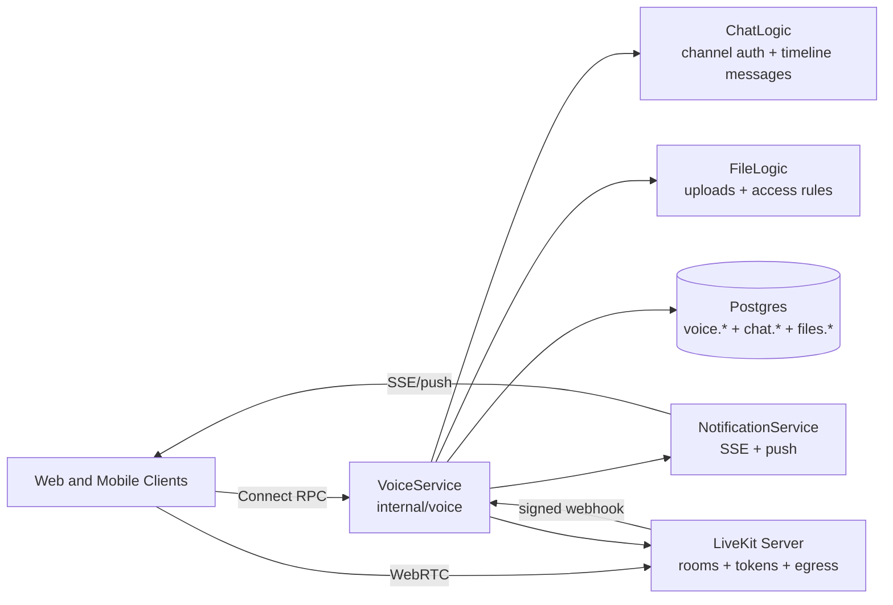

# Voice Communication Architecture

This document describes the implemented voice communication system for calls, voice messages, call records, recordings, transcripts, and mobile/web discovery.

## Ownership

The backend keeps persistent voice business state in Postgres under the `voice` schema. LiveKit owns the media plane only: room transport, WebRTC signaling, participant media sessions, and egress recording. Notification SSE is the discovery plane for ringing, active-call banners, call state refreshes, and post-call record refreshes.



## Call Lifecycle

1. `StartVoiceCall` reuses Chat authorization to verify the employee can access the channel.
2. Voice creates a `voice.call_session`, creates a LiveKit room, upserts the initiator as a participant, mints a room-scoped join token, writes a chat system message, and publishes a live SSE event.
3. `JoinVoiceCall` and accepted invitations recheck channel access, enforce participant caps, upsert participant state, and mint a token for the same LiveKit room.
4. `LeaveVoiceCall` marks the participant left. Direct-message calls behave like phone calls: once answered, either participant leaving ends the call as `completed` for both sides. Group/channel calls remain joinable until the final active participant leaves or an explicit end request closes the call.
5. Ending a call deletes its LiveKit room, whichever path ended it. `voice_call_ended` is a live-only SSE event that is never replayed, so room teardown is the terminal signal that does not depend on the client being reachable; clients re-read `GetActiveVoiceCall` on an unexpected disconnect rather than assuming the call is over.
6. Direct-message invite responses are terminal while the call is still ringing: decline ends the call as `declined`, caller cancellation ends it as `cancelled`, and an expired invite response ends it as `missed`. Group invite decline only changes that invitee's participant state and leaves the group call running.
7. LiveKit webhooks reconcile participant joins/leaves, room-finished events, and egress status. Unknown rooms are accepted and ignored so LiveKit retries do not poison the queue.

Postgres remains the source of truth. LiveKit reconnects or webhook timing cannot re-open an ended call because all webhook handlers first load the call by `(organization_id, livekit_room_name)` and return early for ended sessions.

### Direct And Group Call Behavior

The integration coverage in `backend/integration/voice_communication_test.go` treats these outcomes as the behavior contract:

| Scenario | Result |
|---|---|
| A starts a direct-message call with B | The call is `ringing`; A is joined immediately; B receives a persistent `voice_call_incoming` alert with caller, channel, and invitation metadata. |
| B accepts before the direct call ends | The invitation is accepted, the call becomes `active`, B receives LiveKit credentials for the same room, and the incoming alert is acknowledged. |
| B declines while the direct call is still ringing | The invitation is `declined`; the direct call ends as `declined`; A receives a participant-scoped `voice_call_ended` signal; the timeline says `Voice call declined`; B's incoming alert is acknowledged. |
| A cancels a ringing direct call before B answers | The call ends as `cancelled`, is no longer discoverable, the pending incoming alert is acknowledged, and the timeline says `Voice call cancelled`. |
| B responds after the direct invitation has expired | The invitation is `expired`; the unanswered direct call ends as `missed`; the stale incoming alert is acknowledged; the timeline says `Voice call missed`. |
| Either direct participant leaves after the call was answered | The call ends as `completed` for both participants and disappears from active-call discovery. |
| A starts a group/channel call | The call is announced in the timeline, visible channel members can discover and join it, and only one active call is allowed per channel. |
| A group invitee declines | That invitee is marked declined, but the group call keeps running for remaining and future participants. |
| A group call is explicitly ended or the final active participant leaves | The call ends, live UI receives `voice_call_ended`, and completed call records become available. |

## Voice Messages

Voice messages are chat timeline messages backed by Files storage:

1. `RequestVoiceMessageUpload` validates MIME, size, duration, and a client deduplication key.
2. Voice requests a Files upload, creates a channel-scoped access rule, and stores `voice.voice_message` with `uploading` state.
3. `ConfirmVoiceMessageUpload` confirms the Files upload, creates the chat timeline message with voice metadata, stores waveform/duration, and marks the voice message posted.
4. `CancelVoiceMessage` finalizes an upload attempt without posting a chat message.

Idempotency is scoped by organization, channel, sender, and client deduplication key. Reused keys with conflicting file metadata are rejected.

## Notifications And SSE

Voice uses two notification classes:

| Event | Policy key | Priority | Delivery | Purpose |
|---|---|---|---|---|
| `voice_call_incoming` | `chat_voice_call_incoming` | Always | persistent | Ringing/high-priority invite alert for the invited employee |
| `voice_call_started` | `chat_voice_call_live` | Silent | live_only | Active-call banner and room discovery |
| `voice_call_updated` | `chat_voice_call_live` | Silent | live_only | Participant count, invite accepted/declined, artifact refresh |
| `voice_call_ended` | `chat_voice_call_live` | Silent | live_only | Clear active-call UI and refresh completed call records |

Live voice updates are published both as channel-scoped events for visible room UI and as participant-scoped live-only events for everyone currently attached to the call. This lets decline, cancel, hangup, and room-finished outcomes clear caller/callee UI even when a browser tab is not actively viewing the chat channel. Incoming-call notifications target explicit invitees and remain persistent so they can drive push/ringing behavior outside the active room. When a call reaches any terminal outcome, backend logic acknowledges pending incoming-call notifications for that call so reconnects cannot replay stale ringing UI.

Mobile incoming-call alerts use the dedicated `voice-calls` Android notification channel and iOS time-sensitive interruption level for background/offline delivery. Foreground SSE drives a persistent in-app incoming-call prompt with Answer/Decline actions; it does not auto-hide like the generic live notification banner and is cleared only by user action or a terminal call event. Offline recipients receive FCM/APNs push fallback when push credentials are configured; the backend marks incoming-call pushes with Android channel `voice-calls`, APNs priority `10`, APNs push type `alert`, default sound, and APNs `interruption-level=time-sensitive`. Full phone-call UI through iOS CallKit or Android Telecom/ConnectionService is not implemented in the current Expo app; adding it would require native CallKit/Telecom integration beyond standard notification presentation.

Incoming-call payloads must be self-describing because the same backend title, message, action data, and navigation target feed the foreground SSE prompt, persisted Alerts list, local notification scheduling, and offline push fallback. The alert title should identify the caller, the body should identify the channel or conversation, and `actionData` must include `channelId`, `channelName`, `channelType`, `callId`, `invitationId`, `senderEmployeeId`, `senderName`, and `alreadyInAnotherCall`. `NavigationTarget` must point at the chat `channel` resource with action `join_voice_call`; clients should treat `voice_call_incoming` as an explicit chat-channel route and fall back to Alerts home if no channel route is available.

## Security Boundaries

- Connect RPC auth and RBAC gate every VoiceService method through proto access-control options.
- Voice logic rechecks Chat channel access for every call, invite, record, and voice-message operation.
- Every database query includes `organization_id`; LiveKit room names include the compact organization ID and are resolved back to an organization before webhook reconciliation.
- LiveKit join tokens are short-lived, bound to one room, one participant identity, and microphone-only publish sources.
- LiveKit webhooks are authenticated by `webhook.ReceiveWebhookEvent` with the configured API key/secret provider.
- Files access rules are created for the chat channel before a voice message or call artifact can be referenced from the timeline.

## Configuration

Required local defaults are in `backend/internal/voice/config.go` and `backend/docker/livekit.yaml`.

| Variable | Purpose | Local default |
|---|---|---|
| `LIVEKIT_URL` | Backend-to-LiveKit API/signaling URL | `ws://localhost:7880` |
| `PUBLIC_LIVEKIT_URL` | Client-facing LiveKit URL; falls back to `LIVEKIT_URL` | empty |
| `LIVEKIT_KEYS` | Optional shared LiveKit key mapping; backend uses the first entry when explicit key and secret are unset | unset |
| `LIVEKIT_API_KEY` | LiveKit API key | `devkey` |
| `LIVEKIT_API_SECRET` | LiveKit API secret | `devsecretdevsecretdevsecretdevsecret` |
| `VOICE_JOIN_TOKEN_TTL` | Join token lifetime, max 15 minutes | `5m` |
| `VOICE_MAX_PARTICIPANTS` | Per-room participant cap | default max from code |
| `VOICE_QUALITY_POLICY` | `balanced`, `low_bandwidth`, or `high_quality` | `balanced` |
| `VOICE_AUDIO_ONLY_BITRATE_KBPS` | Audio bitrate envelope | `48` |

Recording is optional and must be complete when enabled:

| Variable | Purpose |
|---|---|
| `VOICE_RECORDING_ENABLED` | Enables LiveKit egress recording |
| `VOICE_RECORDING_BUCKET` | S3/R2 bucket for OGG recordings |
| `VOICE_RECORDING_ENDPOINT` | S3/R2 endpoint, optional for AWS S3 |
| `VOICE_RECORDING_REGION` | S3/R2 region, defaults to `auto` |
| `VOICE_RECORDING_ACCESS_KEY_ID` | Storage access key |
| `VOICE_RECORDING_SECRET_ACCESS_KEY` | Storage secret key |
| `VOICE_RECORDING_FORCE_PATH_STYLE` | Path-style upload toggle, defaults true |
| `VOICE_RECORDING_PREFIX` | Object prefix, defaults `voice-recordings` |

The recording config also falls back to existing `R2_*` variables for bucket, endpoint, and credentials.

## Local Development

The repo includes helper targets that inject a consistent local voice env before Docker Compose and backend startup:

```sh
make voice-dev-infra-up
make voice-dev-backend
```

Override `TECH_OFFICE_HOST_IP` when you want the backend to return a LAN-reachable LiveKit URL for a physical device:

```sh
TECH_OFFICE_HOST_IP=192.168.1.178 make voice-dev-infra-up
TECH_OFFICE_HOST_IP=192.168.1.178 make voice-dev-backend
```

Under the hood the backend Compose file includes a local LiveKit service with built-in TURN-over-TLS enabled:

```sh
docker compose -f backend/docker-compose.yml up postgres livekit
```

LiveKit listens on:

- `7880/tcp`: HTTP/WebSocket signaling and API
- `7881/tcp`: TCP RTC fallback
- `50000-50100/udp`: UDP RTC port range
- `5349/tcp`: LiveKit built-in TURN over TLS

The local config uses `devkey` / `devsecretdevsecretdevsecretdevsecret` for LiveKit. Set `TECH_OFFICE_HOST_IP` to your LAN IP when testing from a physical device so the backend returns a reachable LiveKit URL.

## Production LiveKit transport runbook

LiveKit owns ICE server discovery and TURN credentials. The app backend only returns `livekit_url`, `livekit_token`, `room_name`, and token expiry in voice join credentials.

Production runs from the Docker Swarm stack in [`deploy/`](../../deploy/README.md); everything below is set in `deploy/.env` and rendered into `deploy/config/livekit/livekit.yaml`.

1. Choose the media transport with `LIVEKIT_TRANSPORT`. See the next section — the short version is `mux` for a small office, `host` when one socket starts to hurt.
2. Signalling only goes through Traefik: `wss://${MEDIA_DOMAIN}` terminates on the edge node and forwards to LiveKit's `7880`. Media never touches the proxy.
3. Set `LIVEKIT_NODE_IP` to the voice node's LAN IP for a LAN-only deployment, or leave it empty for an internet-facing one so LiveKit discovers its public address over STUN. This is the single most common cause of "the call connects but there is no audio".
4. Open the chosen media ports on the voice node: `LIVEKIT_TCP_PORT` plus either `LIVEKIT_UDP_PORT` or the `LIVEKIT_UDP_RANGE_START`–`LIVEKIT_UDP_RANGE_END` range.
5. If Cloudflare sits in front of the stack, proxy only the HTTPS hostnames. Keep the UDP media path DNS-only unless you have Spectrum configured for it.
6. Verify clients can connect from web and mobile networks — including a phone on mobile data, not just the office LAN — then capture room name, client platform, network profile, and selected relay or direct candidate path in the smoke checklist.

## UDP mux versus UDP range

`LIVEKIT_TRANSPORT` picks between two shapes, and `deploy/scripts/lib.sh` renders the matching LiveKit config and stack file.

- `host` — a UDP range (`rtc.port_range_start`/`rtc.port_range_end`, default `5000-6000`) gives LiveKit many host ports to advertise and spread participant traffic across. This is the shape LiveKit prefers for raw performance and scale. It needs the container on the voice node's own network stack, so exactly one LiveKit task runs there, and Traefik and the backend reach it at `LIVEKIT_HOST` instead of by service name.
- `mux` — a single UDP port (`rtc.udp_port`, default `7882`) pushes all direct RTC traffic through one public port. It keeps LiveKit on the overlay network and needs one firewall rule, which is why it is the default; but it concentrates all media on one socket and becomes the first place you feel contention as room counts and bitrate rise. Swarm also cannot publish a port *range* in host mode, so a range genuinely requires the host-network variant.
- The embedded TURN server is off in both. TURN/TLS wants `443/tcp`, which Traefik owns on the edge node, and an embedded TURN listener cannot share it. ICE-TCP on `LIVEKIT_TCP_PORT` is the fallback for clients that cannot send UDP; a real TURN relay for HTTPS-only corporate networks needs a dedicated L4 TLS edge on a separate `turn.` hostname, which this deployment does not set up.
- TURN relay range (`turn.relay_range_start` and `turn.relay_range_end`) is a different knob. It constrains the UDP sockets the embedded TURN server uses when relaying media to the SFU; it is not the same thing as the public client-facing RTC media range and usually does not require matching edge firewall openings.

## Operations

- **Webhook failures**: check backend logs for `rejected livekit webhook` or `failed to process livekit webhook`; verify the backend resolved the same LiveKit key pair exposed by `LIVEKIT_KEYS` or your explicit `LIVEKIT_API_KEY` and `LIVEKIT_API_SECRET` overrides.
- **Stale active call**: inspect `voice.call_session` and `voice.call_participant` for active participants. A final `LeaveVoiceCall` or LiveKit `room_finished` webhook should close the call.
- **Recording stuck processing**: check LiveKit egress logs, then inspect `voice.call_artifact.provider_job_id`, `storage_key`, and `error_message`.
- **Mobile/WebRTC issues**: verify `PUBLIC_LIVEKIT_URL`, that Traefik's `livekit-signal` router is serving `${MEDIA_DOMAIN}` on 443, direct UDP reachability on the configured media port or range, `LIVEKIT_NODE_IP`, and whether the client selected a direct or relay candidate.