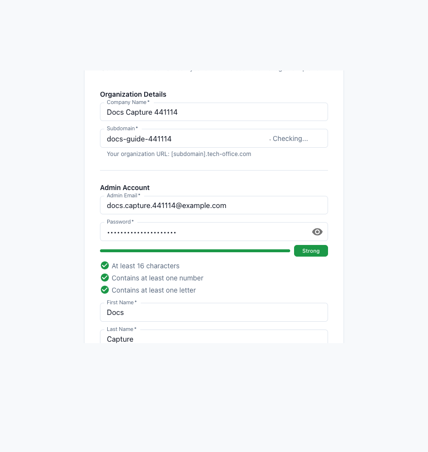
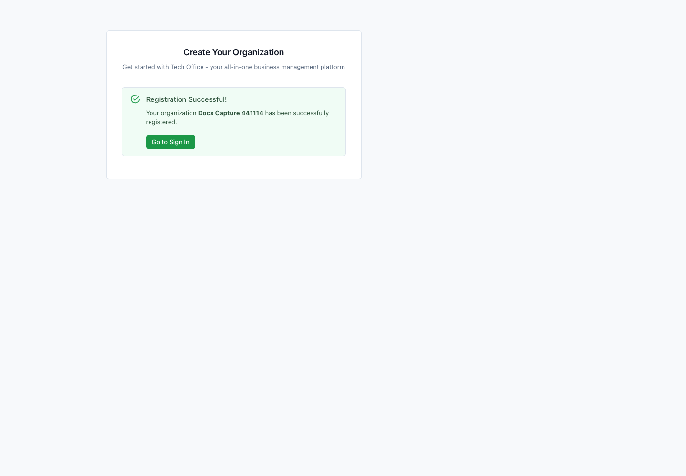
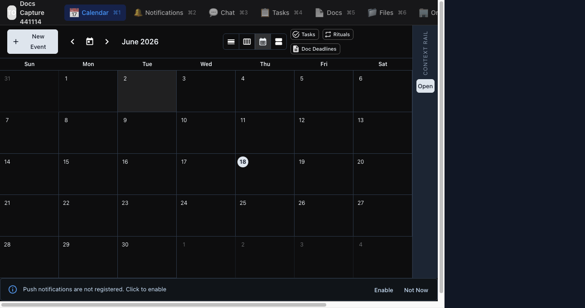

# Getting Started with TechOffice

Last reviewed: 2026-06-18

Tags: `getting-started`, `sign-in`, `registration`, `owner`, `it-admin`, `employee`, `screenshots`

TechOffice is a workspace for day-to-day operations: organization setup, employee management, notifications, chat, voice, projects, recurring ritual work, calendar scheduling, documents, files, search, and mobile work.

Use this page to choose the right path. Owners and IT admins should follow the setup guides. Employees should follow the daily-work guides.

## Documentation Menu

The end-user documentation should be organized around tasks, not around internal implementation plans.

- **Start Here**
  - What TechOffice is for
  - Register or sign in
  - Choose the owner/admin path or employee path
- **For Owner or IT Admin**
  - Register your organization
  - Invite your team members
  - Set up departments and managers
  - Set up projects and task workflow
  - Set up recurring rituals and evidence requirements
  - Set up calendar resources and booking links
  - Prepare notifications, chat, docs, and files
- **For Employee**
  - Sign in to the right workspace
  - Check your notifications
  - Use direct messages and group chat correctly
  - Check your schedule
  - Complete tasks and submit evidence
  - Find docs, files, people, and shared links
- **Feature Reference**
  - Lookup all current features by capability, platform, status, and related task guide.

## Register a New Organization

Use this path when you are the first owner or IT admin creating the workspace.

1. Open `https://transformar.work/signin/`.
2. Select **Register your organization**.
3. Enter the organization name and a short lowercase subdomain.
4. Enter the first admin email, password, first name, and last name.
5. Wait for the subdomain availability check.
6. Select **Create Organization**.

Example:

- Organization name: `North Star Clinic`
- Subdomain: `north-star-clinic`
- Admin email: `admin@northstar.example`

The subdomain is the workspace identifier employees use during sign-in. Keep it short, recognizable, and easy to read aloud.

After registration succeeds, return to sign in with the new subdomain and first admin email.

Related features: [Account Access](05-feature-reference.md#account-access), [Organization Management](05-feature-reference.md#organization-management)

## Sign In

Use this path when your organization already exists.

1. Open `https://transformar.work/signin/`.
2. Enter your organization subdomain.
3. Enter your email address or account ID.
4. Email users enter a password or use an enabled SSO provider.
5. Account ID users enter the six-digit PIN provided by the organization.
6. If you belong to more than one organization, confirm the active workspace before acting.

Related features: [Account Access](05-feature-reference.md#account-access), [Mobile App](05-feature-reference.md#mobile-app)

## First Workspace Screen

After sign-in, TechOffice opens into the workspace with primary navigation, search, context rail, and notification setup.

Use the top navigation to move between **Calendar**, **Notifications**, **Chat**, **Tasks**, **Docs**, **Files**, and **Organization**.

- Owners and IT admins should continue with [Owner and IT Admin Guide](03-admin-guide.md).
- Employees should continue with [Employee Guide](04-employee-guide.md).
- Anyone who wants a lookup list should use [Feature Reference](05-feature-reference.md).

## Quick Start for Owners and IT Admins

Your goal is to turn the real organization into a usable workspace before asking the team to work inside it.

1. Register the organization or sign in with an owner/admin account.
2. Open **Organization** and create the first departments.
3. Invite email or SSO employees, create PIN accounts, or import employees in bulk.
4. Review roles and permissions before delegating admin work.
5. Create one real project and choose standard, ritual, or mixed collaboration mode.
6. Configure calendar resources, docs, files, chat channels, and notifications.

Read next: [Owner and IT Admin Guide](03-admin-guide.md)

## Quick Start for Employees

Your goal is to find what needs attention, respond, and complete assigned work without hunting through menus.

1. Sign in with the method your organization provided.
2. Open **Notifications** on web or **Alerts** on mobile.
3. Check **Calendar** or **Schedule** for meetings, shifts, and invitations.
4. Open **Tasks** for standard tasks and ritual work.
5. Use **Chat** for channels, direct messages, files, voice messages, and calls.
6. Use **Docs**, **Files**, and search for reference work.

Read next: [Employee Guide](04-employee-guide.md)

## Web and Mobile

- **Web app**: Best for setup, management, calendar scheduling, project configuration, document editing, file management, and review workflows.
- **Mobile app**: Best for alerts, chat, voice, quick task updates, ritual evidence capture, calendar checks, and opening links from notifications.

## What to Read Next

- Current feature inventory: [Current Product Feature List](00-current-feature-list.md)
- Core terminology: [Core Concepts](02-core-concepts.md)
- Owner/admin tasks: [Owner and IT Admin Guide](03-admin-guide.md)
- Employee tasks: [Employee Guide](04-employee-guide.md)
- Feature lookup: [Feature Reference](05-feature-reference.md)
