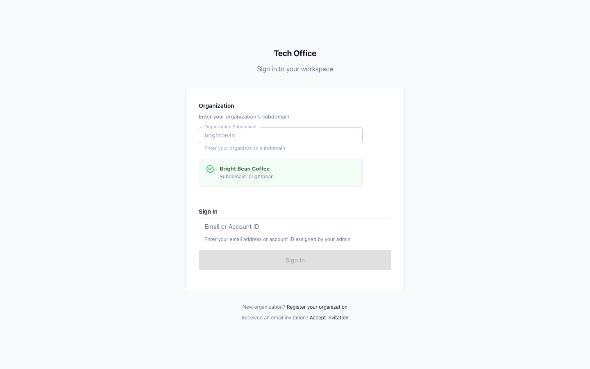
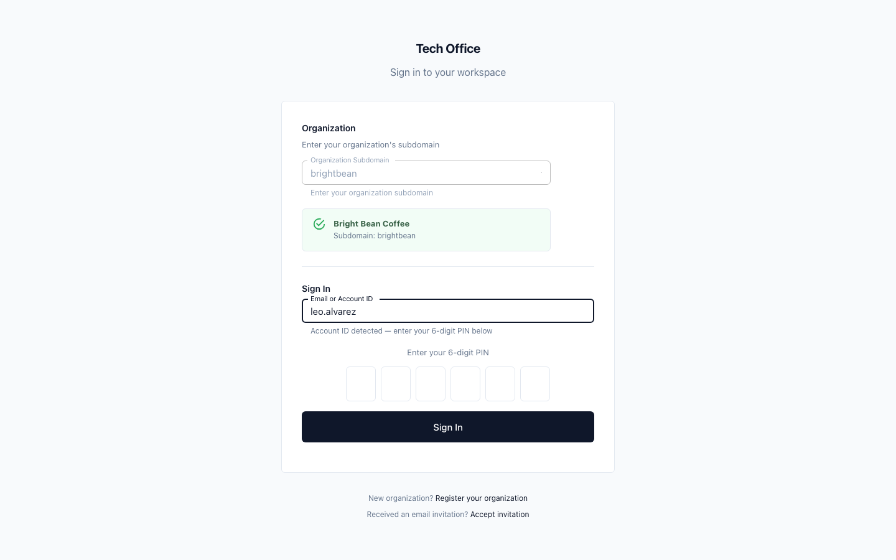
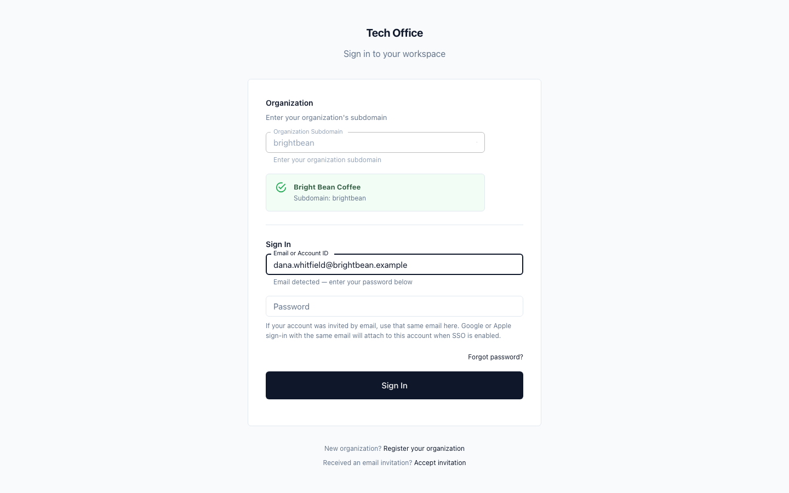
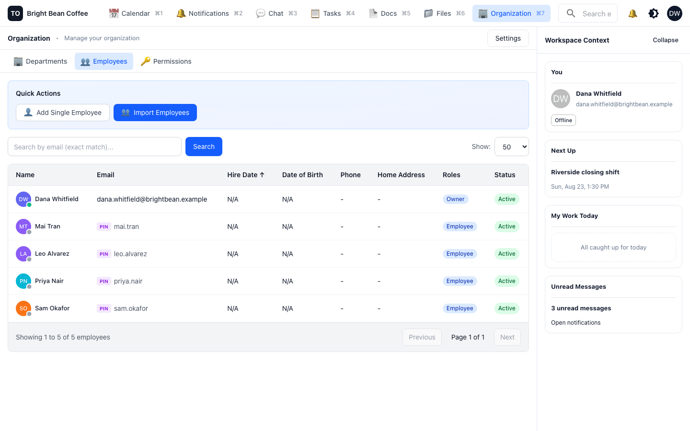
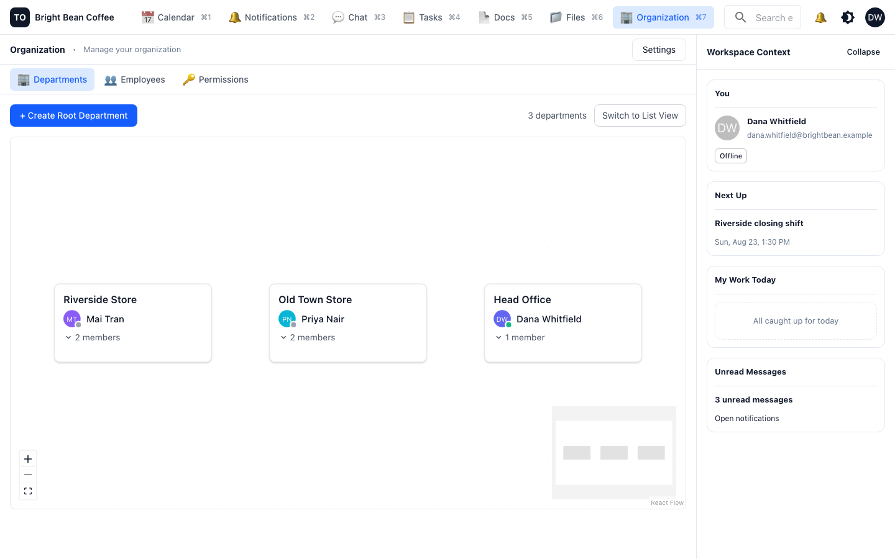
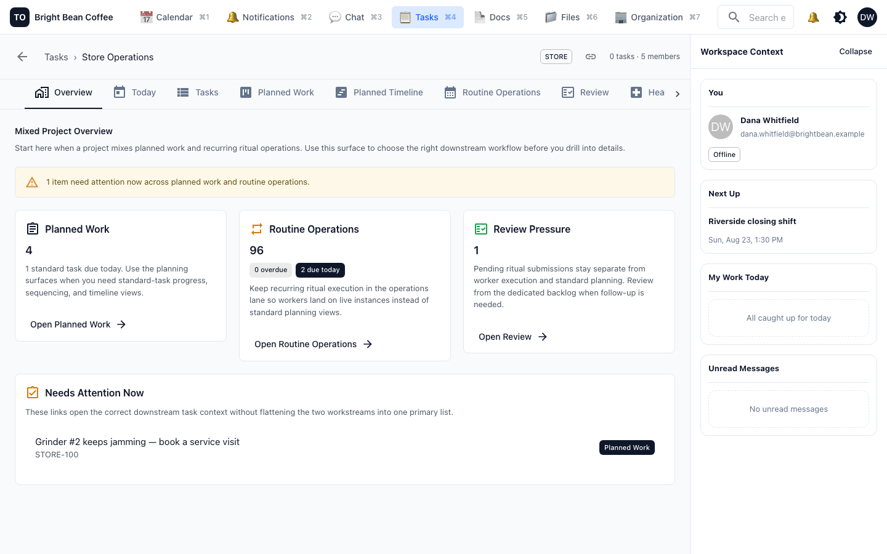

# Set up your workspace

**Who this is for:** the owner, or whoever handles IT for the business.
**How long:** about 30 minutes for a team of ten.
**What you end up with:** everyone in your business signed in, sorted into the places they
actually work, and able to reach each other.

---

## 1. Create the workspace

Go to the TechOffice sign-in page and choose **Register your organization**. You give the
business name, pick a subdomain, and create the first admin account in one form.

The subdomain is the short name your staff type when they sign in. Bright Bean Coffee used
`brightbean`. Keep it short and easy to say out loud over the noise of an espresso machine
— your staff will read it off a card taped next to the till.

**The password must be at least 16 characters** and contain at least one letter and one
number. The form shows the three rules as you type and keeps **Create Organization** greyed
out until all of them are green — including after the last field, so if the button looks
dead, click once to leave the field and again to submit.

The account you create here is the **owner**. It holds every permission, including the ones
you cannot grant to anyone else: bulk employee import, storage quota, role management, and
creating staff accounts. Use a real address you control, not a shared `info@` mailbox.

Registration signs you out again — you land back on sign-in and log in with what you just
created. The first screen after that is your **Calendar**, which will be empty. Everything
else is reached from the row of links along the top; that top bar is the whole navigation.

## 2. Understand the two kinds of account before you add anyone

This is the decision that matters most, and it is easier to get right the first time than
to change later.

| | Email account | Account ID + PIN |
|---|---|---|
| Signs in with | Email address and password, or Google / Apple | An account ID you choose, plus a 6-digit PIN |
| Needs an email address | Yes | **No** |
| Can reset their own password | Yes, by email | No — an admin issues a new PIN |
| Right for | Owner, managers, office staff | Baristas, drivers, cleaners, shop floor, anyone deskless |

Both kinds sign in on the same page. Your staff type the workspace subdomain once, then
their email or their account ID — TechOffice works out which one they gave and asks for the
right thing.

Type an account ID like `leo.alvarez` and you get a PIN keypad.

Type an email address and you get a password field, plus Google and Apple sign-in if you
have those enabled.

### Rules worth knowing about PINs

- A PIN is exactly six digits.
- When you create an account, TechOffice shows you a **temporary PIN once**. Write it down
  or hand it over immediately — you cannot look it up again. If it is lost, reset the
  account and issue a new one.
- The temporary PIN expires after three days and must be changed on first sign-in.
- Staff cannot choose a PIN that is their own date of birth or the last six digits of their
  phone number, if you recorded those.
- Wrong PINs lock the account for progressively longer: one minute after three tries, five
  minutes after four, fifteen after five. After six, an admin has to unlock it. This is
  deliberate — an account ID and a PIN taped to a wall is a real risk in a shop, and the
  lockout is what makes it survivable.

## 3. Add your people

Open **Organization → Employees**.

There are two buttons, and the first one covers both kinds of account:

- **Add Single Employee** — one person at a time. It first asks which kind of account you
  want:
  - **Email / SSO Account** for managers and office staff. They get a join link and set
    their own password. The link expires in seven days.
  - **Managed Account (PIN Login)** for everyone without a work email. You give a given
    name, a family name and a **Login Identifier** — this is the same thing the sign-in
    page calls an *Account ID*, and it is what the person types to log in. Then TechOffice
    hands back the temporary PIN.
- **Import Employees** — upload a CSV or spreadsheet. TechOffice previews every row and
  tells you what will fail *before* anything is written, so a bad column does not create
  half a roster. Owner-only.

Either way the last step is **Assign Roles**, which defaults to **Employee**. That is the
right answer for most people; see [step 5](#5-decide-who-can-do-what) before you change it.

Notice in the screenshot how Dana has an email address and everyone else has a `PIN` badge
next to an account ID. That is what a normal small-business roster looks like here.

Pick a naming convention for account IDs and stick to it. `firstname.lastname` is boring
and works. Badge numbers work too if your staff already have them.

## 4. Sort people into departments

Open **Organization → Departments**.

For a small business, a department is usually a **place** or a **function** — not a slice
of an org chart. Bright Bean created three: *Riverside Store*, *Old Town Store*, *Head
Office*. Each one has a manager.

To build that:

1. Select **+ Create Root Department** (on an empty workspace the button says **Create
   First Department**). Give it a name and, optionally, a description — for a store, the
   address and opening hours are useful here.
2. Repeat for each store or function. Create them all before assigning anyone.
3. Open a department and add its people. Assign each person as **member**, and the person
   who runs it as **manager**.

Do the people first and the departments second — you cannot assign someone who does not
exist yet, which is why this step comes after step 3.

Departments earn their keep in three ways, so it is worth doing even at five people:

1. **You can address a whole department at once.** Mentioning a department in a message
   notifies everyone in it — no keeping a list of who is on the Riverside team.
2. **Recurring work can be assigned to a department instead of a person**, and TechOffice
   rotates it round-robin or gives it to whoever has the least on. See
   [Run your daily checklists](02-run-your-daily-checklists.md).
3. **Presence can be limited to your department**, so staff see who else is on shift at
   their store without seeing the whole company.

Departments nest if you need them to, but resist it. Two levels is almost always enough.

## 5. Decide who can do what

Open **Organization → Permissions**. Every workspace starts with three roles:

| Role | What it can do |
|---|---|
| **Owner** | Everything. Cannot have its role-management permissions taken away. |
| **Operator** | Everything except importing employees, changing storage quota, managing roles, and creating staff accounts. This is the right role for a store manager. |
| **Employee** | Everyday work: chat, tasks, submitting and reviewing proof, calendar, docs. Cannot invite people, import, manage roles, or change the department structure. |

You are also offered these roles at the moment you create each person, so in practice you
will set most of them there and only come to this tab to change one later.

You can create your own roles if these do not fit, but most small businesses never need to.
The safe default is: owner for you, operator for your managers, employee for everyone else.

Permissions are checked per action, not per job title, so promoting someone is one change
in one place.

## 6. Make one project

Open **Tasks**. You will already find a project there called **General**, created for you at
registration. It is an ordinary empty project — you can rename it and use it, or leave it
alone and make your own. What you must not do is quietly end up with both and no idea which
one the work is in.

Select **New Project**. Bright Bean made a single project called *Store Operations* and put
all five people in it.

### Choose the collaboration mode carefully

The dialog asks for a name, a key (the prefix on task numbers, like `STORE-14`), private or
public, and a **Collaboration Mode**. That last one is the important one, and it is easy to
click past:

| Mode | What you get |
|---|---|
| **Standard** | Planned work only — board, list, timeline, calendar, analytics. **No recurring checklists at all.** |
| **Ritual** | Recurring checklists only — Today, Review, Health, Worklist. |
| **Mixed** | Both, kept in separate sections. |

**Choose Mixed** unless you are certain you want only one of the two. A Standard project has
no Rituals tab in its settings and no Today, Review or Health tab, so
[Run your daily checklists](02-run-your-daily-checklists.md) cannot be followed in one — and
the mode is set when the project is created.

A project can hold two different kinds of work, and TechOffice keeps them visually apart on
purpose:

- **Planned work** — one-off tasks with an owner and a due date. *"Grinder #2 keeps jamming
  — book a service visit."*
- **Routine operations** — the recurring checklists. *"Riverside opening checklist."*

Mixing those into one list is how small businesses lose track of both. The Overview tab
above is the answer to "what needs me right now" across the two.

Do not create a project per store. Create one project for operations and use departments
and assignees to separate the stores. You can always split later; merging is harder.

---

## You are done when

- Every member of staff can sign in on their own phone, using either an email or an account
  ID and PIN.
- Each person is in exactly one department, and each department has a manager.
- You have one project, and everyone who does the work is a member of it.

## Next

[Run your daily checklists](02-run-your-daily-checklists.md) — the part of TechOffice that
replaces the clipboard.
