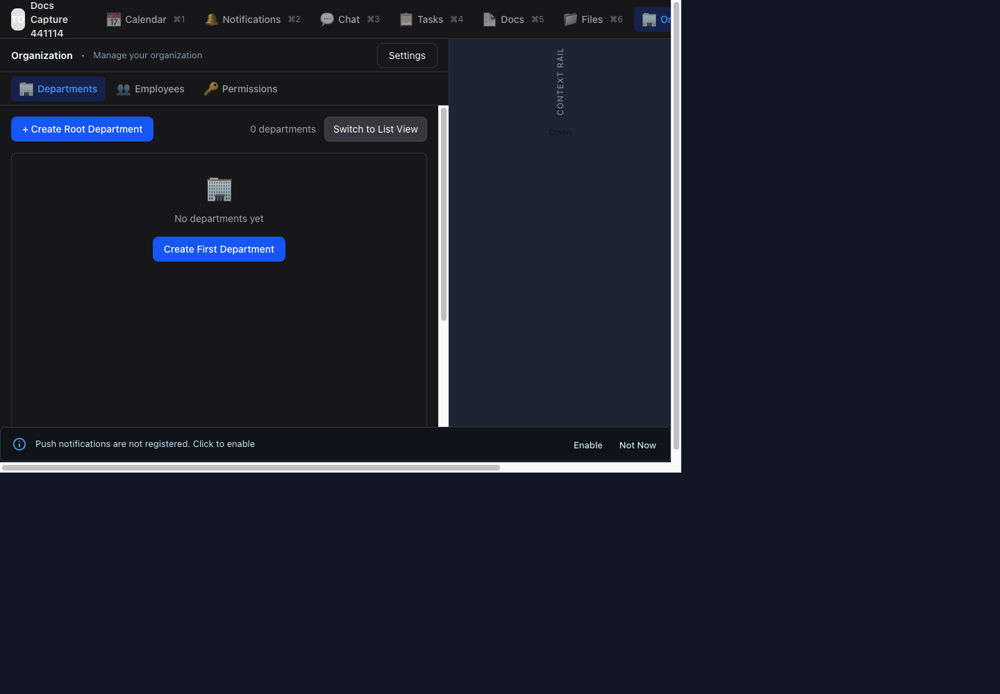

# Owner and IT Admin Guide

Last reviewed: 2026-06-18

Tags: `owner`, `it-admin`, `organization`, `departments`, `employees`, `permissions`, `projects`, `rituals`, `calendar`, `docs`, `files`

This guide is for the people who create the workspace, invite the team, set up work systems, and keep operations healthy. Each workflow includes an example, steps, screenshots, and links to the related feature reference.

## 1. Register Your Organization

Use this when your company does not have a TechOffice workspace yet.

1. Open `https://transformar.work/signin/`.
2. Select **Register your organization**.
3. Enter the company name and subdomain.
4. Enter the first admin account details.
5. Wait for the subdomain availability check.
6. Select **Create Organization**.

Example:

- Company name: `Docs Capture 441114`
- Subdomain: `docs-guide-441114`
- Admin email: `docs.capture.441114@example.com`

After the success message, select **Go to Sign In** and sign in with the subdomain and admin email.

Related features: [Account Access](05-feature-reference.md#account-access), [Organization Management](05-feature-reference.md#organization-management)

## 2. Confirm the Active Workspace

Use this before making setup changes, especially when you manage more than one organization.

1. Check the organization name in the top-left workspace header.
2. Use the profile or organization switcher if you need a different workspace.
3. Confirm that the top navigation shows the expected modules: **Calendar**, **Notifications**, **Chat**, **Tasks**, **Docs**, **Files**, and **Organization**.
4. Continue only after the active workspace is correct.

Example: If you manage `North Star Clinic` and `North Star Lab`, switch before creating departments or inviting employees. Employee records, files, projects, and permissions are scoped to the active organization.

Related features: [Account Access](05-feature-reference.md#account-access), [Search and Links](05-feature-reference.md#search-and-links)

## 3. Set Up Departments and Managers

Departments make employee assignment, manager visibility, search, notifications, and permissions easier.

1. Open **Organization**.
2. Select **Departments**.
3. Select **Create Root Department** or **Create First Department**.
4. Create only the top-level groups you will actually use, such as `Operations`, `Sales`, `Support`, `Warehouse`, or `Store A`.
5. Add child teams when they matter for assignment, reporting, or communication.
6. Assign managers after employee records exist.
7. Use org chart or list view to verify that the structure is easy to understand.

Example first structure:

- Operations
- Sales
- Support
- Field Team

Related features: [Organization Management](05-feature-reference.md#organization-management), [Search and Links](05-feature-reference.md#search-and-links)

## 4. Invite Your Team Members

Use the onboarding method that matches how each worker signs in.

1. Open **Organization**.
2. Select **Employees**.
3. For office workers, invite them with email or SSO so they can manage their own sign-in.
4. For frontline, temporary, field, or shared-device workers, create an org-managed PIN account.
5. For batches, use import and review the preview table before confirming.
6. Assign each employee to the correct department and role.
7. Save any one-time temporary PIN before closing the result screen.

Example decisions:

- Use email invite for `maya@northstar.example`, the operations manager.
- Use a PIN account for `night-shift-17`, a shared-device worker who does not use email daily.
- Use bulk import for a store opening with 80 employees.

Related features: [Account Access](05-feature-reference.md#account-access), [Organization Management](05-feature-reference.md#organization-management)

## 5. Delegate With Roles and Permissions

Roles are permission bundles. Use them to delegate repeatable admin work without giving every operator owner access.

1. Open **Organization**.
2. Select **Permissions**.
3. Review who can invite employees, import employees, manage departments, manage roles, create projects, review evidence, manage calendar resources, delete files, and change quotas.
4. Keep owner access limited to recovery and high-risk settings.
5. Create operator roles for repeatable administration.
6. Use project membership for authority that should apply only inside one project.
7. Review permissions after each rollout phase.

Example roles:

- `People Operator`: invite employees, import employees, manage departments.
- `Project Lead`: create tasks, manage project members, review evidence inside assigned projects.
- `Facilities Scheduler`: manage calendar resources and booking links.

Related features: [Organization Management](05-feature-reference.md#organization-management), [Projects, Tasks, and Rituals](05-feature-reference.md#projects-tasks-and-rituals)

## 6. Set Up Projects and Task Workflow

Projects organize work. Start simple, then add workflow complexity only when the team needs it.

1. Open **Tasks**.
2. Select **New Project**.
3. Give the project a short name and key. The key becomes part of task identifiers.
4. Choose visibility: public for broad discovery, private for restricted teams.
5. Choose collaboration mode: standard, ritual, or mixed.
6. Add members and assign project roles.
7. Configure states, task levels, custom fields, and workflow rules only when they clarify the work.

Example project:

- Name: `Q3 Product Launch`
- Key: `PRJ56D0F`
- Mode: `Mixed`, because the team has one-off launch tasks and recurring readiness checks.

Related features: [Projects, Tasks, and Rituals](05-feature-reference.md#projects-tasks-and-rituals), [Chat and Voice](05-feature-reference.md#chat-and-voice)

## 7. Set Up Recurring Rituals and Evidence

Rituals create scheduled task instances for repeated operational work. Evidence is useful when a task needs proof before review or completion.

1. Open the project where the recurring work belongs.
2. Create a ritual definition with a clear title and schedule.
3. Add default assignees, departments, or reviewers.
4. Set the completion window.
5. Add evidence requirements only when proof matters.
6. Save the ritual and verify upcoming instances.
7. Use the review backlog to approve, reject, or request corrected evidence.

Example rituals:

- Store opening checklist, due every morning before opening.
- Safety inspection, due every Friday with photo evidence.
- End-of-shift report, due at the end of each shift with text notes.

Related features: [Projects, Tasks, and Rituals](05-feature-reference.md#projects-tasks-and-rituals), [Notifications and Presence](05-feature-reference.md#notifications-and-presence)

## 8. Set Up Calendar Resources and Booking Links

Use calendar resources when people need to reserve rooms, equipment, vehicles, or shared spaces.

1. Open **Calendar**.
2. Select **New Event** for meetings, shifts, company events, or maintenance windows.
3. Add required and optional attendees.
4. Check availability before choosing a time.
5. Add resources such as rooms, vehicles, or equipment when needed.
6. Use booking links when someone else should choose from available times.
7. Use check-in or evidence only for events where proof is operationally required.

Example resources:

- `Training Room A`
- `Delivery Van 2`
- `Portable Scanner Kit`

Related features: [Calendar and Scheduling](05-feature-reference.md#calendar-and-scheduling), [Notifications and Presence](05-feature-reference.md#notifications-and-presence)

## 9. Prepare Notifications, Chat, Docs, and Files

Set up the places where daily work will happen before you invite the whole team.

1. Open **Notifications** and enable push notifications on trusted admin devices.
2. Open **Chat** and create channels for teams, projects, operations, or announcements.
3. Use private channels only for restricted groups.
4. Create root docs for policies, handbooks, procedures, and project notes.
5. Review file storage quotas and cleanup responsibilities.
6. Explain when employees should use mentions, direct messages, task discussions, voice messages, and live calls.

Example channel setup:

- `General Announcements`: broad updates.
- `Operations`: daily coordination.
- `Q3 Product Launch`: project-specific discussion.
- Direct messages: one-on-one coordination that does not need a group.

Related features: [Notifications and Presence](05-feature-reference.md#notifications-and-presence), [Chat and Voice](05-feature-reference.md#chat-and-voice), [Docs](05-feature-reference.md#docs), [Files](05-feature-reference.md#files)

## 10. Launch Checklist

Before inviting the whole organization, confirm:

- The organization name and subdomain are correct.
- Departments and managers are understandable.
- Employee invite, import, and PIN account workflows have been tested.
- Owner and operator roles are assigned correctly.
- The first project is understandable.
- Ritual evidence requirements are realistic from web and mobile.
- Notifications and push prompts are ready for time-sensitive work.
- Calendar resources and booking links are configured if needed.
- Docs and files have clear access rules.

Related features: [Feature Reference](05-feature-reference.md)
