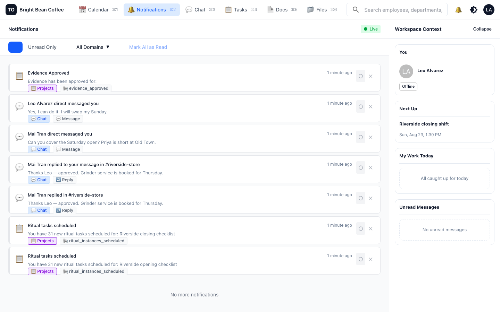
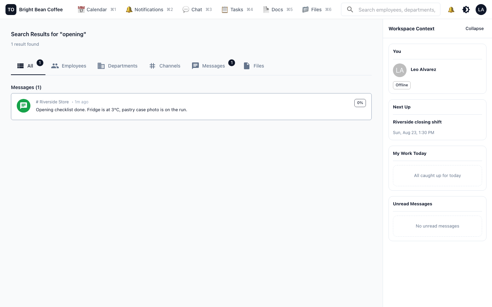

# Keep work in one conversation

**Who this is for:** everyone.
**The problem it solves:** the decision is in a group text, the photo is in someone's
camera roll, the reason is in a phone call nobody else heard, and the person who needed to
know was off that day.

TechOffice does not try to replace talking to each other. It tries to make sure the talking
leaves a record attached to the thing it was about.

---

## Where a conversation belongs

There are four places to talk, and picking the right one is most of the skill.

| Use | When | Who sees it |
|---|---|---|
| **A channel** | Anything the shift or the store needs to know | Everyone in that channel |
| **A direct message** | Something between two people | Just the two of you |
| **A task or checklist discussion** | Anything about *that specific piece of work* | Everyone following that task |
| **A voice call or voice message** | Faster to say than to type, hands busy | The channel it happens in |

The rule of thumb: **if it is about a specific job, say it on the job.** Every task and
every checklist run has its own discussion thread. A comment there reaches the people
following that work, and it is still there in three months when someone asks why the
grinder was replaced.

## Channels

Bright Bean has three: **Announcements**, **Riverside Store**, **Old Town Store**.

That is the right number for a business this size. One channel per store, one for things
everyone must see. Resist the urge to make a channel per topic; a small team reads
everything or nothing.

Notice the sidebar. **Task Discussions** are listed alongside channels, because a task's
comment thread *is* a channel — the same conversation surface, attached to the work. You do
not switch apps to talk about a task.

A few things worth knowing:

- **Replies are one level deep.** You can reply to a message; you cannot reply to a reply.
  This is a deliberate limit — a thread that branches four levels is a thread nobody reads.
- **Edits and deletes leave a trace.** An edited message is marked as edited and keeps its
  history; a deleted one leaves a placeholder. Nobody can quietly rewrite what was agreed.
- **Mention a department to reach everyone in it.** Mentioning *Riverside Store* notifies
  the whole store, and you never have to maintain a list of who that is this month.
- **Attach files in the channel.** Photos of a broken machine, a delivery note, a supplier
  quote. The file stays with the conversation, and who can open it is decided by who can
  see the channel — not by anyone remembering to set a permission.

### Per-channel notification settings

Each channel can be set to **all messages**, **mentions only**, or **muted**. Set your
Announcements channel to all and your busiest store channel to mentions if you are an owner
covering two sites. This is per person, so nobody else is affected by your choice.

## Voice, when typing is the wrong tool

Any channel — including a direct message — can host a **live voice call**, and you can leave
a **voice message** when the other person is on the bar and cannot answer.

Calls leave a record in the channel timeline: started, ended, missed. A missed call from
your manager at 06:15 is visible in the conversation, not just in a call log nobody opens.
Calls are recorded and transcribed where you have that enabled.

There is at most one live call per channel, which is the behaviour you want: you cannot end
up with two half-conversations in the same room.

## Notifications: how you find out

One list, everything in it: chat, direct messages, replies, task assignments, proof
approved or rejected, calendar invites, document comments. Filter by source when you want
just one kind.

Two behaviours that are worth understanding, because they are what make TechOffice reliable
on a phone in a shop:

**Push arrives only if the app did not.** When something happens, TechOffice delivers it
live to any app you have open. If your phone does not confirm it received the event within
a couple of seconds, it sends a push notification instead. You are not double-notified for
the same thing, and you are not silently missed because a connection looked alive but was
not.

**Seen is not the same as done.** Scrolling past a notification marks it read. It is only
*acknowledged* when you open the thing it points at, or dismiss it deliberately — and
acknowledging is what cancels the pending push. This is why an unread badge you scrolled
past can still ping your phone: TechOffice is not convinced you dealt with it.

### Turning the noise down

Under **Settings → Notifications** you can set a do-not-disturb window and mute whole areas
of the product. Muting affects **push only** — the workspace stays live and up to date when
you open it, your phone just stays quiet.

Under **Settings → Presence** you choose who can see whether you are online: everyone, only
people in your department, or nobody. Store staff usually want *departments*.

## What "connected" actually means here

A concrete example from the Bright Bean workspace, all from one morning:

1. Leo completes the opening checklist and submits the fridge reading as proof.
2. Mai gets a notification that proof is waiting, approves it with a note.
3. Leo gets a notification that his proof was approved.
4. Leo posts in the store channel that the house blend is down to two bags.
5. Mai replies in the thread that a service visit is booked for Thursday.
6. That thread is attached to the store channel; the grinder task it refers to has its own
   discussion, and the task shows up as due today in everyone's Today view.

No copying, no re-typing, no "did you see my text". Each step notified exactly the person
who needed it, and every piece of it is still findable next month.

## Finding things again

The search box at the top searches **people, departments, channels and messages**. It is
fuzzy and multilingual, so a near-miss on a name still finds the person.

Be aware of the current limit: search does **not** yet cover documents, files, tasks or
calendar events. To find a document, use the search box inside **Docs**; to find a task,
use the project's task list. This is a known gap rather than a design choice.

## Next

[Run the schedule](04-run-the-schedule.md) — shifts, meetings and the meeting room.
