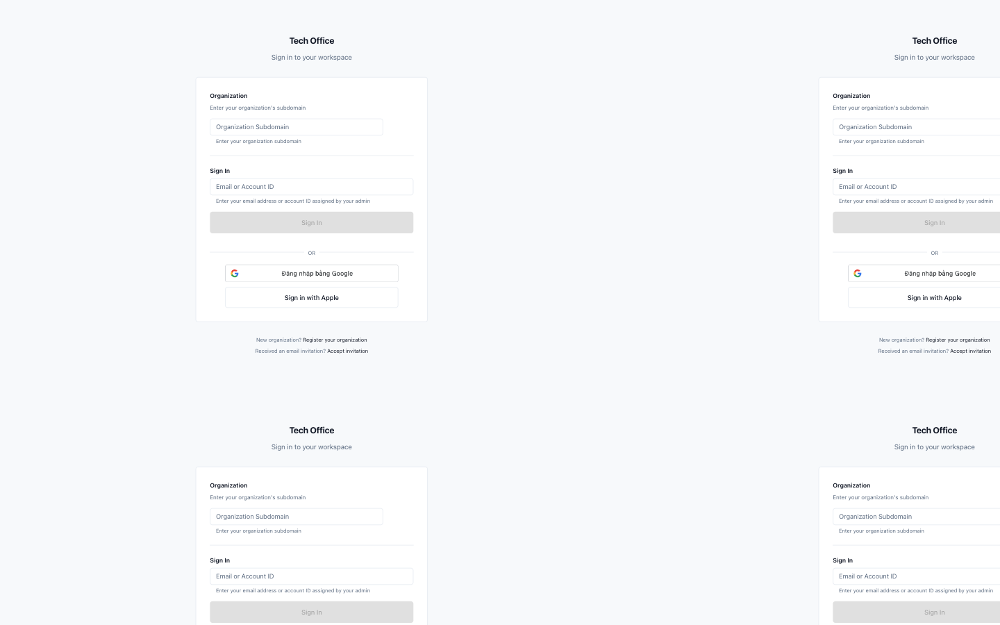
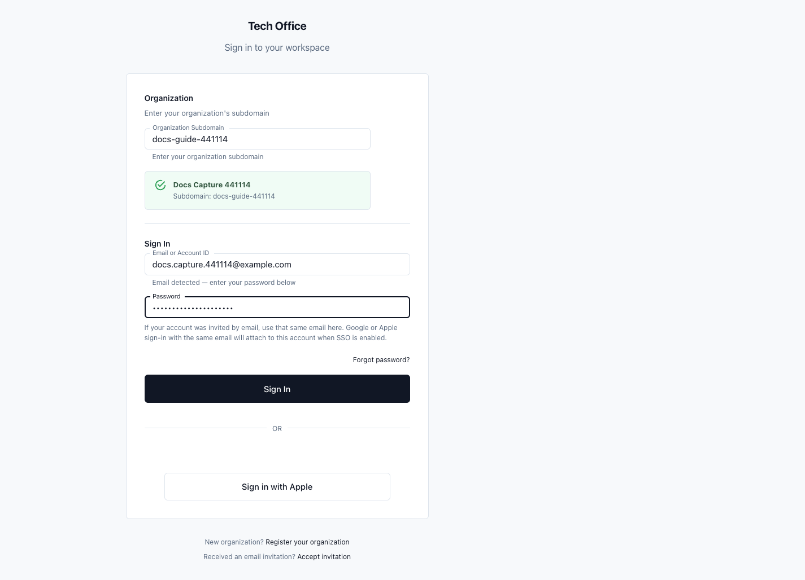
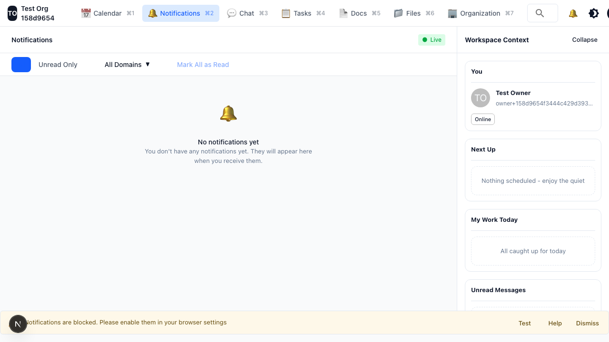
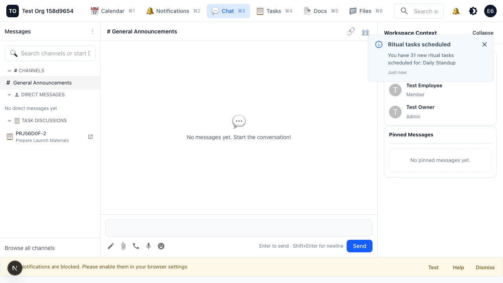
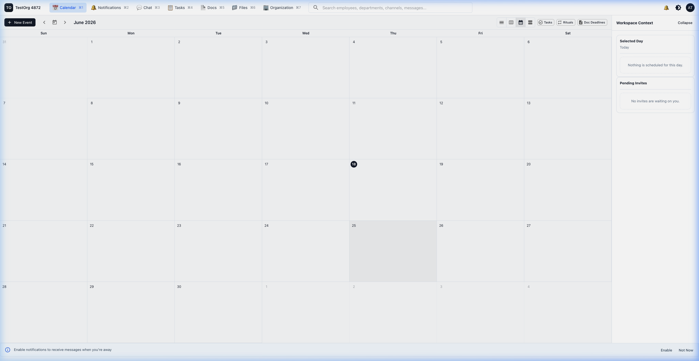
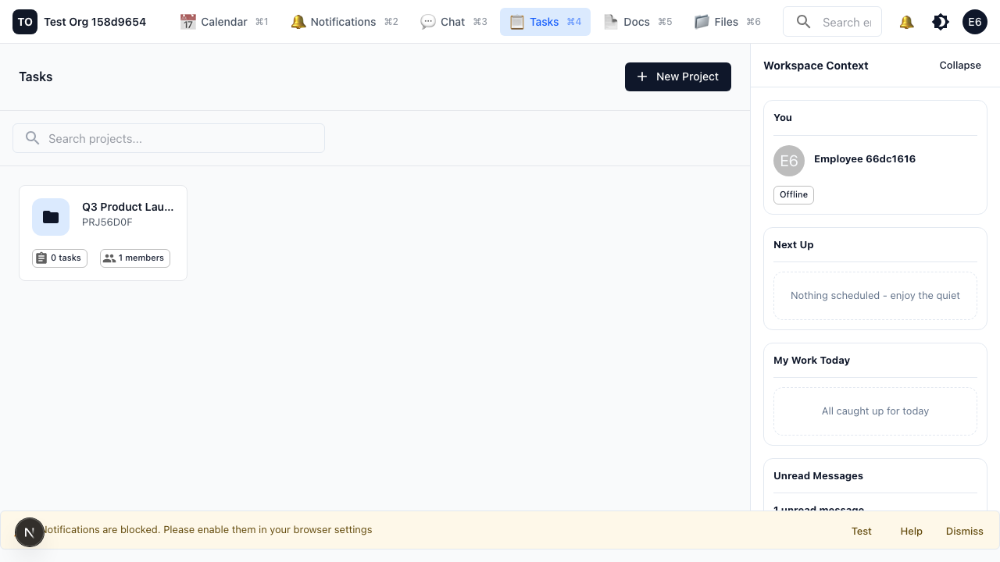

# Employee Guide

Last reviewed: 2026-06-18

Tags: `employee`, `sign-in`, `notifications`, `alerts`, `calendar`, `tasks`, `rituals`, `evidence`, `chat`, `voice`, `docs`, `files`, `search`

This guide is for employees using TechOffice to see what needs attention, communicate with teammates, manage schedule changes, and complete assigned work.

## 1. Sign In to the Right Workspace

Your organization may give you email/password, Google or Apple SSO, an invitation link, or an account ID with a six-digit PIN.

1. Open the sign-in page.
2. Enter the organization subdomain from your manager or invitation.
3. Enter your email address or account ID.
4. If you use email, enter your password or select the SSO provider your organization enabled.
5. If you use an account ID, enter your six-digit PIN.
6. If you belong to more than one organization, choose the workspace where you want to work.

Example: If your manager gives you `north-star-clinic`, `frontdesk-03`, and a temporary PIN, enter the subdomain, enter `frontdesk-03` as the account ID, then enter the PIN. TechOffice may ask you to set a new PIN before entering the workspace.

Related features: [Account Access](05-feature-reference.md#account-access), [Mobile App](05-feature-reference.md#mobile-app)

## 2. Check Your Notifications

Notifications are your daily inbox. They collect work from chat, tasks, rituals, calendar events, docs, files, and system activity.

1. Open **Notifications** on web or **Alerts** on mobile.
2. Start with unread items.
3. Open a notification to jump to the exact chat, task, event, document, or file.
4. Mark the item as read after handling it.
5. Use source filters when you are catching up after time away.
6. Allow push notifications on trusted devices when your work is time-sensitive.

Example: A task assignment notification should open the task detail. A calendar invitation should open the event. A chat mention should open the channel or thread.

Related features: [Notifications and Presence](05-feature-reference.md#notifications-and-presence), [Search and Links](05-feature-reference.md#search-and-links)

## 3. Use Direct Messages, Group Chat, and Task Discussions

Use the smallest conversation space that includes the people who need to act.

1. Use a **direct message** for one-on-one coordination.
2. Use a **channel** for team, project, operations, or topic conversations.
3. Use a **task discussion** when the conversation belongs to a specific task.
4. Use a reply when you are responding to one message.
5. Use a mention when a person or department needs to act.
6. Attach files when the conversation needs shared context.
7. Use a voice message when recording is faster than typing.
8. Use a live voice call when the group needs to talk now.

Examples:

- Direct message: Ask your manager a private scheduling question.
- Channel: Share an update for everyone in Operations.
- Task discussion: Ask a question about `Prepare Launch Materials` so the answer stays with the task.

Related features: [Chat and Voice](05-feature-reference.md#chat-and-voice), [Files](05-feature-reference.md#files)

## 4. Check Your Schedule

Open **Calendar** on web or **Schedule** on mobile to see meetings, shifts, invitations, and booking details.

1. Open **Calendar** or **Schedule**.
2. Choose day, week, month, or agenda view.
3. Open event details to see attendees, time, location, meeting link, resources, and notes.
4. Respond to invitations when RSVP is available.
5. Use booking links when someone asks you to choose from available times.
6. Complete check-in or evidence only when the event asks for it.

Example: If you receive a calendar invite for safety training, open the notification, review the event details, RSVP, then check the room or resource listed on the event.

Related features: [Calendar and Scheduling](05-feature-reference.md#calendar-and-scheduling), [Notifications and Presence](05-feature-reference.md#notifications-and-presence)

## 5. Complete Tasks and Submit Evidence

Tasks are where assigned work lives. Ritual tasks are recurring tasks generated from a schedule.

1. Open **Tasks**.
2. Search or select the project that contains your work.
3. Open the assigned task.
4. Review the title, description, state, assignees, watchers, files, discussion, and due window.
5. For standard tasks, update the state when your work moves forward.
6. For ritual tasks, open the generated ritual task instance.
7. Submit every required evidence item.
8. Watch for approval, rejection, or resubmission notifications.

Example: For an end-of-shift report, open the ritual task instance, enter the text report, attach any requested file, submit it, then watch for reviewer feedback.

Related features: [Projects, Tasks, and Rituals](05-feature-reference.md#projects-tasks-and-rituals), [Files](05-feature-reference.md#files)

## 6. Use Docs, Files, Search, and Links

Reference work should be findable without asking someone where it lives.

1. Use search for people, departments, channels, messages, docs, files, and calendar events.
2. Open **Docs** for policies, procedures, project notes, and team handbooks.
3. Follow documents you need to watch for updates.
4. Use comments or replies when a document needs review.
5. Open files from the chat, task, doc, event, or evidence item where they were attached.
6. Open TechOffice resource links directly. If you are signed out, sign in and return to the resource.
7. If a link says access denied, ask the channel, project, document, or organization admin for access.

Example: Search for `return policy`, open the document, copy a citation link to the exact section, and paste it into a task discussion.

Related features: [Docs](05-feature-reference.md#docs), [Files](05-feature-reference.md#files), [Search and Links](05-feature-reference.md#search-and-links)

## 7. Mobile Daily Routine

The mobile app is organized around five work areas: **Chat**, **Tasks**, **Schedule**, **Alerts**, and **More**.

1. Open **Alerts** first.
2. Check **Schedule** for meetings, shifts, and invitations.
3. Open **Tasks** for assigned work and ritual evidence.
4. Respond in **Chat** when messages need action.
5. Use **More** for profile, files, docs, search, and settings.

Example: If a push notification says your evidence was rejected, open the alert, go to the task, read the reviewer comment, correct the evidence, and resubmit.

Related features: [Mobile App](05-feature-reference.md#mobile-app), [Notifications and Presence](05-feature-reference.md#notifications-and-presence), [Projects, Tasks, and Rituals](05-feature-reference.md#projects-tasks-and-rituals)

## Troubleshooting

- **I cannot sign in**: Check whether your account uses email, SSO, or PIN. PIN accounts need the correct workspace subdomain and account ID.
- **My PIN is locked**: Ask an owner or IT admin to unlock or reset the account.
- **I cannot open a link**: You may be signed into the wrong organization or lack access.
- **I cannot submit evidence**: Make sure you opened the generated ritual task instance, not only the ritual definition.
- **I do not receive alerts**: Check notification permissions, push permission, and notification preferences.

Related features: [Account Access](05-feature-reference.md#account-access), [Search and Links](05-feature-reference.md#search-and-links)
