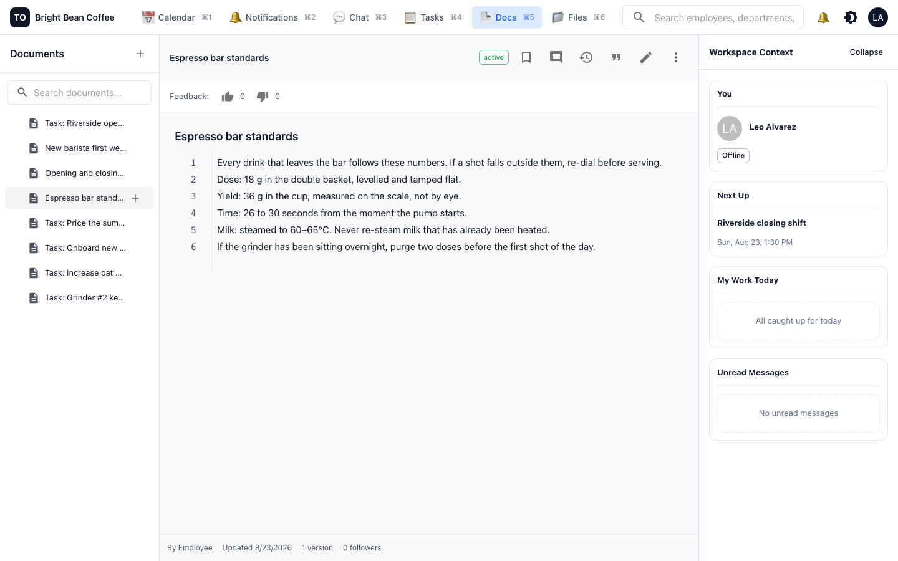

# Write down how you do things

**Who this is for:** owners and managers writing it down; everyone else reading it.
**The problem it solves:** the way your business does things lives in one person's head. When
they are on holiday, the answer is a phone call. When they leave, the answer is gone.

---

## Documents are the "why"; checklists are the "what"

Keep these separate and both stay useful:

- A **checklist** (ritual) says *do this, prove it*. Short, actionable, on shift.
- A **document** says *this is how we do it and why*. Read once, referred to when something
  is unusual.

Bright Bean's opening checklist has an item "Fridge temperature reading". The document
*Opening and closing procedure* is where it says that dairy above 4°C for more than two
hours gets thrown out — which is why the reading is taken at all.

Do not put the explanation in the checklist. Nobody reads three paragraphs at 06:30.

## Writing one

Open **Docs → +**.

Documents nest into a tree, so you can group them: *Bar standards*, *Opening and closing*,
*New barista first week*.

The three documents Bright Bean started with are a good template for any small business:

1. **The standard** — the numbers and rules that do not change. Dose, yield, shot time,
   milk temperature.
2. **The procedure** — how a recurring job is done, and why each step exists.
3. **The onboarding path** — what a new person does on day one, day two, day five.

That is enough to train someone without you standing next to them.

### Write for the person doing the job

Short lines. Concrete numbers. No policy voice. Compare:

> Milk: steamed to 60–65°C. Never re-steam milk that has already been heated.

against "Team members should ensure appropriate milk handling procedures are observed". The
first one is usable at the bar.

## What documents give you that a shared drive does not

**Full version history.** Every save is a complete snapshot with an author and an optional
summary — a commit message for your procedures. You can compare any two versions, and see
line-by-line who wrote what. When someone asks "when did we change the shot time", there is
an answer.

**Nothing is pruned.** Old versions are kept indefinitely.

**Comments and replies on the document itself.** A barista can ask a question against the
line they did not understand, and it is resolvable — so answered questions stop cluttering
the page.

**Links that survive a rename.** Rename a document and old links still work. The link you
pasted into the store channel six months ago does not break.

**Quoting between documents.** One document can quote a line range from another, and the
quote is a **snapshot** — it shows the target as it was when you quoted it, so editing the
source never silently rewrites the document that cited it. You can also see which documents
cite the one you are reading.

**Per-document access.** By default everyone in the workspace can read a document. You can
grant read-and-comment or write access to specific people or a whole department, and you can
explicitly deny. Use this for anything with pay, discipline or supplier pricing in it.

### Editing together

Several people can have a document open at once and you will see who is in it and where
their cursor is. Be aware that TechOffice does **not** merge simultaneous edits
character-by-character — if two people type in the same paragraph at the same time, the last
save wins. In practice: for a small business this is fine, but do not have two people
rewriting the same section at the same time. Say so in the channel first.

## Files

**Files** is the workspace's storage view: everything attached anywhere — chat messages,
tasks, checklist proof, calendar events, documents.

You do not usually go here to attach something. You attach files where the work is: in the
channel, on the task, as proof on a checklist. Files just gives you the view across all of
it, plus deletion and storage usage.

What happens to a file you upload:

- It is **scanned for viruses**, every time, without exception. If the scan cannot complete,
  the file is treated as failed rather than waved through.
- Its **real type is checked against what it claims to be**, so a `.jpg` that is actually
  something else is flagged.
- **Who can open it is decided by where you attached it**, on the server. A file in a private
  channel is not readable by someone outside it, and there is no setting for anyone to get
  wrong.
- Office documents are **converted to PDF** for preview.
- Deleting is soft and logged, so an accidental delete is recoverable and a deliberate one is
  auditable.

Your workspace has a storage quota and a maximum file size (100 MB by default). Only the
owner can change them.

### A practical note on photos

Checklist photo evidence adds up faster than anything else in a small business — a daily
pastry case photo across two stores is 700+ photos a year. Check **Files** occasionally and
clear out what you no longer need. Photos attached to proof that has already been approved
and reported on are usually safe to remove after your record-keeping period.

## Known limit

The main workspace search box does **not** search documents. Use the search box inside
**Docs** to find a document by title or content. Document search itself works well —
including across languages — it is just not wired into the global search box yet.

## Next

[Reference](06-reference.md) — where everything lives, and what the limits are.
